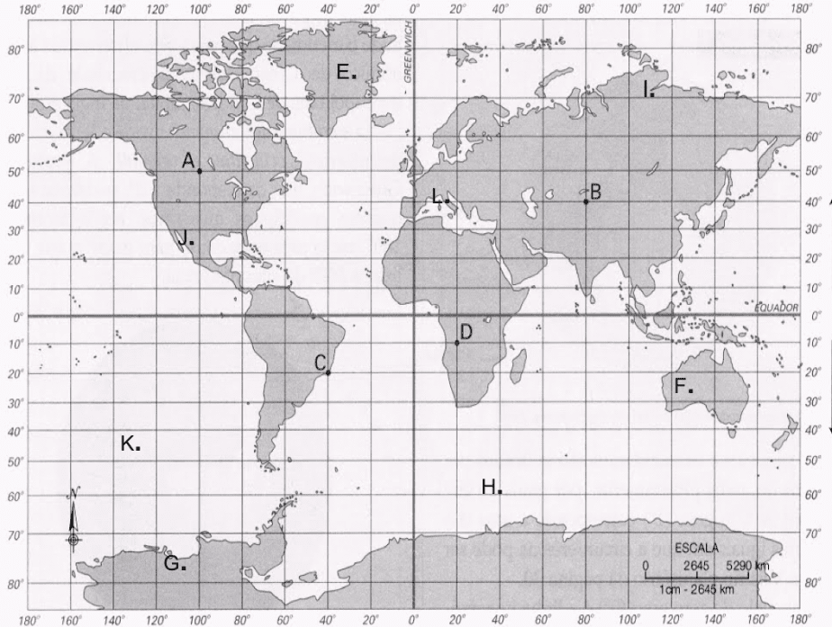
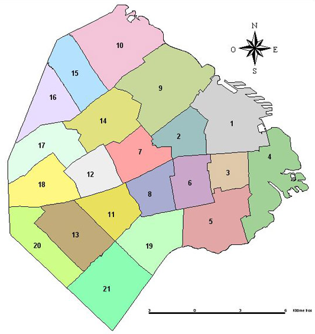

# TP 5 - NoSQL - MongoDB

## Intro

Tras la vaga revelación de RDJ sobre la posible solución al conflicto desencadenado, el objetivo era claro: ir al lugar del primer ritual.

Durante nuestro camino, RDJ nos reveló más información acerca del detonante del caos.

"Su ritual dejó remanentes de energía por los cuales los espíritus comenzaron a invadir nuestro plano." —sus palabras parecían cuidarse de no revelar cierta información— "Solo los poseídos como yo somos capaces de ver esos remanentes siempre que estemos conectados a otros espíritus."

Seguimos transitando nuestro trayecto hasta el origen del primer ritual, viendo posteos tras posteos sobre más sucesos paranormales que estaban sucediendo, ahora, alrededor de todo el mundo. 

Una vez llegados al cuarto donde todo inició, RDJ dio un paso hacia adelante, su espíritu siguiéndolo tras soltar una leve risa. Palabras fueron dichas por los labios de RDJ previo a la aparición de una esfera de energía oscura sobre su palma. Un leve brillo era emitido desde la opaca masa de energía invocada mientras RDJ comenzaba a recorrer la habitación sin rumbo aparente...

"Los remanentes de energía reaccionan a las altas concentraciones de energía."

Unos segundos después de sus palabras, la esfera comenzó a brillar cada vez más y más. Él los había encontrado. La concentración de energía se dispersó, revelando una suerte de runas a lo largo y alto de las paredes del cuarto. Nuestros rostros presentaron sonrisas de lado a lado al creer que estábamos un paso más cerca de la solución al problema y de nuestra absolución moral tras nuestras travesías. Sin embargo, aquel espíritu, supuestamente bajo el control de RDJ, demostró su demoníaca naturaleza.

<p align="left">
  
</p>

Con una voz aguda y desgastada invocó una serie de cadenas hechas de un flujo de energía que nos retuvieron inmóviles tanto a nosotros como a RDJ, quien miraba extrañado al ente que lo acompañaba.

<p align="right">
  
</p>

Su resquebrajada voz resonó de nuevo, haciendo aparecer a múltiples demonios, agresivos entre sí, desde aquellos símbolos de energía presentes en las paredes. Pero el espíritu habló de nuevo.

<p align="center">
  
</p>

### Coordenadas

Desde ahora, las ubicaciones que desarrolladas durante los TP anteriores pasaran a tener una coordenada de geolocalización que nos ayudarán a procesar mejor el comportamiento de las entidades de nuestro modelo.

### Dominio de espíritus

Como vimos en nuestras experiencias con RDJ, los espiritus ahora seran capaces de dominar y controlar a otros. Pese a no tener mucha información sobre este accionar, nuestras hipotesís nos llevaron a suponer las siguientes limitantes sobre estos seres.

- Los espiritus podran dominar unicamente a los espiritus que esten en un rango de 2 a 5 kilometros de alcance.
- Los espiritus podrán controlar unicamente a espiritus que no esten vinculados a médiums.

## Servicios

Se deberán modificar los siguientes servicios:

### MediumService

- `void pudrirse(Long mediumId)` - El médium se consume en su propia desesperación.

### EspirituService

- `Cadaver arrepentirse(Medium medium)` - EXORCISMO?… ¿Pretendes expulsarnos? ¡JA! Seremos más fuertes que tú… cada espíritu dominado es una atadura más en tu alma.

### Cambios en el modelo

Los médiums… serán prisioneros de sus propias cadenas, atrapados entre planos que jamás entenderán. Las ubicaciones no son más que trampas, estructuras en la penumbra, sucias, corruptas...

- Las coordenadas son i̷n̸s̴i̸g̴n̵i̶f̷i̶c̸a̶n̶t̴e̵s̵. Lo que antes era un punto en el mapa ahora es un vortice hacia lo d̴̼͂ê̷̗̂s̴̤̅̉c̴͈̄̈ǫ̵̜̉n̷̥̹͗͊ŏ̴̘͌c̸͉͓̾̃ĭ̶̻d̵̥̮͂̋ȏ̷̯̼.
- L̵̤̐ỗ̶̥s̴͎͠ ̶̨̎̈́ȩ̶͘ṡ̵̫́p̸͇̦̓i̵̫͙̔͗r̴͕̬͆ĩ̵̉ͅẗ̶̠́̀ḭ̴̰̎̅s̷̼̓͝t̵̡͑a̸̰̹̍s̷̞͖̀ ̸͚̽͒s̴͙̫̍̓ö̸̬́͘n̵̨̬̏ ̷̼̆m̶̫͍̈́̈́ë̶͎́̏r̷̠̈͂ͅö̶̠̤́̓s̵̟͒ ̵̢͚̄̈́p̵̧͇̀̂è̷͇̭o̴̤̒n̸͓̞͌e̷̩̙̓̇s̸̻̔,̴͙̬̔͝ ̷̠̬̀̽p̸̣̮͆͝o̵̟̖͌s̵̫͒ḯ̸̙c̷̫̊ị̸̠̄o̴͜͠͠ǹ̴ͅa̷̪̘͝d̷̩͉͌o̶̘̞͊s̵̯̎͆ ̶̯̏p̵̢̓ȁ̷͉̃r̸̯̬̅̆a̸͔̝͋̾ ̴̤̈́̀s̵̩̐͛ū̷̳̱ ̷͇̈͛d̴͍̻͂e̶͖̹͆̚ṣ̵̒̄ť̸̝r̸͓̿u̵̪̞̎c̴͕̈́ć̵͜į̴̖͂ó̶̲̝̓n̴̟̄́.̸͕̫̏͠ ̸̘̚͝S̷̭͑͆u̸̻̓s̶̳̫͊ ̴̫̰̓̆c̴̪͌͠o̴̪̞̐n̶̟̍͝o̵͙͚̍c̵̟̑ḭ̶̄̽m̸̧̨͒i̵̲̺̒e̵̥̤͛̾n̶̼̈t̷̺͑̆ó̶͍̮̑s̷͔̜̀̔ ̷̱̤͗̒s̵̟̲̀̎e̴͙̤͑̀ ̷̛̖ͅṿ̸̞̎ú̴̱̈́e̶̢̕l̵͉͝v̸̬̺͐͌é̴͔̪̊n̷̗̺̚ ̶̘͐̚ͅc̷̬̝͒o̷͖͐n̷͍͛͝ţ̸́̓ṛ̴̨͒̈â̴̠ ̶͔͈͑̈e̵̡͚̿̐l̵̫̉͠ļ̶̤̚͝o̷̼͇̕s̷̫͆̈́͜,̷͖͝ ̴͉̗͠d̴̪̀̈́e̸̛̪̍v̷̳̈́̈́o̷̡͙͋̿r̷͉͑ͅá̴̢̫̐n̴͙͖̾d̶̦͆ȏ̸̝ ̵͚̆s̶͍̫̊̀ù̷̩͘ ̵̜̺̊͝ċ̵̠ȯ̷͇r̴̢̚͠d̸͓̹̚ȕ̴̧͚͒ṛ̸̦̀́ạ̷̛.̷́ͅ

̷̼̬̒̊̾́̏̎Ḑ̷̡̺̽̒̚ȩ̸̼̜͓̎͌͋̇̕͜s̸̖̥͖̍̃̐ḏ̷̛̥͉̖͛̇̓ê̶̢̨̗͚̣̐ ̷͓̪̲̽͂̚͝e̸̡̟͎̦̟̽ļ̷̺̫͉͍̺̽̓͘ ̷̛̠́̀͋i̴̛̗͆͌̔̓̔ͅn̴͇͕̿͠͠ì̶̛̘͌̎́͋c̷̻̠̽̈́̀͊̕ĩ̵̢̢̝͍͇̤̾̇͆̾̄ò̴͔̫,̵̦̿͆̆͛ ̴̙͎̥̿̀͠l̶̩̮̱̻̩̳̑͆͂͝͝a̷̦͌͋̃̒̌͘ ̶̛̬̻͕͓̳̙̎̿̑̂͝h̷͔̞̀͘u̶̼̬̗̽̓̑͠m̷̨͓͗͌̽̈͝à̵̖̪͍̜̎̐̆̎͒n̷͖̯̲̱̪͖̈́̃͘̕͘i̸̖̮͚̋d̸̢̛͍̗͓̖͔̃͛̈́à̴̭̅̾̾̈́d̷̻̠͍̱̙̙̂͂͆ ̷̡́̍͛͘͠ĕ̸͓͖̼͉͉̬̉̈̈́̅ṉ̴̟̙̹̓̚͝ ̶͖̞̞̤͈̻̔s̵̖͈̈u̷͖͑̍̽ ̷͖̣̣͈̀̆̆̆ͅä̸̧̧̫͇̽̅̕ŗ̷̭̗͖̈̌r̸̼͕̲̩̲̬̋̈́͝o̵̲̫̞͙̬̒̾͛ğ̷̢̼̬̍ą̶̙͕̦͖̱͌̒̓͌n̷̞̈́͗c̴̠̾̉į̴͕͔̲̽͜ǎ̴̢̖͙̻̰̿̊ ̶̱̍h̸̡͈̲̎͆̓̃̉͝á̴̰̙̻̺̟͓̓̿̈́͗ ̸͉̈́̚̕͝͝b̵͚̯͐̒̌̄͋̚u̴̧̡͉̯̦̔̉̓̚͝s̸̛̹̓͐̏͂͠c̷̖̝͎̀ȁ̸̡͎̎̋̄̃͜͝ḑ̴̡̘̼̺̀̅͒̏̌͘o̵̩̳̘͗̇̓͘͜ ̷̠̻̫͔̣͗̽̀p̸̼͑o̵̢̦̜̬̝͔͊̄̚͝d̴̲̰̃͐̕̕e̷̮͈̾̃̈̍͜r̶̘̙̈́̐ẻ̸̙͍͐͐͆s̶͈̱͔̰͖͓̀ ̸̙͓͕̲̮̹̔͌q̴̣̗͇͗͜u̵̮̺̰̳̻͋͂è̶̗̪͕̰̻̓̒̾̈͌ ̸̢̡̩̬̯̠͛͐́̀̋j̸͔̣̯̉ä̶̞͎̣́̏͜m̶̢̺͙͈͌͘á̴͙̥̬̔̄̈́̓̚ͅs̶͇͐̓͆̒̈́͘ ̶̙͍̣̼͚͒ḓ̵̰̠̞̦̾̈̈́͊̚͝è̵̻̤̯̫̱͜b̷̬͈̹͓̂̽́͂͘i̸̭͐́͆͆͌ͅǫ̴̫͎́̂̐͘ ̸̬̱̤̪͈̀̆t̴̲̭̯͐́̃͜͝͠ȯ̸̰͈̝̉͂̌̀͊c̶͍͌́͠a̶͍̰̦̮̯̎̆̕͝r̵̿͂̈́̈̓͜͠.̵̭͓̘̎ ̴̪͇̎̍̈D̸̜̔Ŏ̴̳̹M̴̼̔̉̽̓̑Ȉ̷̗̤͔͍̋̅͜N̸͉͉̘̟͔̿̇̽A̷̺̜̰̅̀̈́̓̀͠Ĉ̷̯̫̞̘͆́̊͘Ĭ̸̥͚͚̭̈́̉̎̈́Ó̸̲̠͚͈̀̀̾́͆͝N̷̯͋́ ̸͍̲̠̙̬̀́͗e̶̘͇̥̝̓ͅs̸̲̜͔̗͆ ̶̡̹̩͉̉̔̄͘ḽ̷̗̰̅̿͝ö̴͙̞͕̗̼̯́̿͛̚ ̵̥̩̣̖̔͊̾̋q̴͈͉̍́̈́ư̵̘̼͒́é̴̠̝͖́̈́͗̾ ̶̟̻͂̀̍͗̓̑ͅa̶̧̧͓̋̐̿̐n̷͚̞͖̊̾̀̇͗s̵̠̈́̑í̴̫̞̙͂͌a̴͙͓͜͠n̴̎̃̚͘͘ͅ,̵̗͗̕͝ ̶͔̲͓͎̈́͒̎̒͆̕͜p̸̱̣̘͓̲̞̽͗́ę̶̈́̕͜͝r̴̮̋o̷̧̤͗̓̃̽͜͜ ̷̧̥̗̳̘͒́͑͠c̶̛͍̬̽͌̋͆͘ą̸̠̹̗͚̃d̸̳̘̀̈́a̸̡͖̝̪̱̒́̍͋͌͝ͅ ̷͉̟̙̂̈̏i̵͚̞̼̤͓͂́̀͆̓n̵̡̢͈̹̞͑̒̽̚͝t̷̨͌̑̚e̷̘͎͇͌̂n̵͉͑ͅt̶̬̫͚̱͒̃̀͌o̵̭͓͕̺̪͖̎͐̊̓̇ ̴̺̭̮̏͠l̵͉̹̾̍́͝͠ơ̵̘̻ș̴̠̒̾͜ ̵̧͕̬͓̌͗̑̓̏͜s̸̈́̉̈́͐͜u̴̬͈͍̇̈̒͊m̵̟̉͑̂͠e̸̦̟̯͈̽̒̈́̑r̷̨̘̼̰͈̮̊g̸̡͎̊͒͛e̴̦̫̊̋͒͆̔ ̷̰͍͙̌̋̔͗̋͠m̸̡̗̩̰̑̐̾̔á̷̢͙̤̭̖̿̎s̶̨̆͆̅͂̅ ̴̨̙̹̤͇̔̍ḛ̵̛̋͆̐n̷̢̧͚̳̪͑̈́̽ ̷̨̛̣͉͙̩̍͛̚̚͝l̶̛̠̮̲͇̮͍̂̏ą̸͔͈̘͕̠̀́͝͝ ̶͉̬̥̞̠̟̀̇̇̅̀͘ô̸̦͉̹̮̔͒̔̚s̵̻͍̽̀̀̇̈́̾c̴͕̉̂û̴͍͚̰̆̔͑r̶̞͙̗͋̈̒͐i̷̛̖̪͖̪̣̾̌͛ḓ̵̜͈̗̦̹̋͘a̶̛̙͔̼̼̿͐͋͛d̸͎̟̽͆̎.̵̢͔̟̺̩̔


Para dominar... DEBES romper estas cadenas:


P̷̷̷̶̷̷̸̵̴̡̨̡̨̡̧̡̢̢̨̡̧̛̛̛͙͕̻͓͉̙̙̗͖̤͔̰͇̻̫̳͈̝̺͇̮̙̖̪̙̲͈̮̤̪̳͍̜̮͕͙͎̼͖͍̜̥̳̝̰͈̫͔̘͍͕̖͖̰̲̜͓̗̻̺̝̮̗͎͍̹͕̣͎͔̤̦̖̼̣̳̬͖͎̞̹̫̦̰͇͔̣̳̙̞̘̱͍̯̲̖̖͉̗͔̠͍̘̟̠̳̬̟͈̞̺͈̠̹̻̥̙̪͔̠̹͙̰͈͙̭̪̬̺̞̗̈́͋͗̒̅̒͑͊̇͒̂͑̔̂͆̌̍̽̾͛̅̃̈́̐͊̊̊͐́̇̓̈́̅̊̐̓̊̑͂̆̆̓̒̀̒͒̇̇̀̀̾̒̉͊̎̋̄̔̈͑̆̉̓̓͊̒̓͒̌̌̾́́̀̀̂̐̏̂͑͂̎̈́͐͋̈́̔͑͑̔̚̚̚͘̕̚̕͜͜͝͝͝͝͝͝͝͠͝ͅͅͅa̷̴̵̵̵̷̸̵̵̵̴̶̸̵̵̸̶̶̢̢̢̡̧̢̡̢̧̢̡̢̡̢̧̧̧̨̡̧̢̛̛̛̛̛̛̛̛̛̛̛̛̗̻̱̪̹̰͎̝̫͙̜͚̝͖̮̠̱̝̻̣̞͔̥͇̗̟̻̱̼͉͈̯͎͔͓̙̼̼͕̱̠͙̱͈͓̠͔͙̗̲͉̻̺̰̳̭͉͔̫͉̦̹͖̯͕̘͚̥͎̺̯̬͖̬̗̻͈̘͍͖̫̦̝̺͖͍̼̱̼̘̲̩̦̪̮͖͉̠͈̹̪̳͉͉͉̘̤̹̤̮͔̲͔̹̪͉̗͈̖̤͇̮̺͓͕̰͚̳̳̥̤͔͍̗̩͈̭̝̬͇̹̺̳̳̰̼͚̠͉̲̻͙̠̻̪̘͙̬̳̮̦͎̳̱͍͈̜̳̲̗̠̫͈̹͖͕̳͎͙͉̖̺̻͍̭̟̮̼̫͚̱̞̫̙̟̫̦̟̰̝̬͕̹̙̟͚͓͈̬͚̦̭͍̞̙̹̱̮̳̘̰̞̰͇̺̪͛̍͊̋̎͐̿́̿̐̎̔̏̽̽̔͐̏̀̅̀͌͑͂̍͆̈̃͋̇̈́͛́͑̀̈̎̓̆͋͑̂͂̌̌̽̾͋̀̓̀̔̆̀͗̍̏̐́̅̓̀̔͂͒̀͑͒̎͂̂̐͒͊̇̈́̇́̐̈́̆̎̏̍̀͒̽̽̇̆͑̄̿̀̈̄̑͆̍͑͑͊͑́́͌̉̃̀̍̽̉́̓̍͑̓̇͂̔̽̍͑̆̌͑͑̏̓̾̐̀̄̀͌̌̃̀̎̇̀͒̏͑̓̿̂̀̆̃̐͛̾̍̌̌̂̍̅̿̽͋̓͗̋̐̽̾͋̅̈́̈̾̉̀̀̈́̈́̑̂̆͋̋̂̋͌̀͗̅̅̈́͋͋͆̐͗̀̒͌̅̉̐͗̐̾͊̑̓͗̈́̋̀̈́̓͐̀́͛̓͗̌͛͑̀̇̈́̈́̐̆̆̽́̈́̉̓̈̓̌͗́̈́̏͋̋̌̏̌̈͘͘͘̚͘͘͘̚̕̚̚̚̕̕̚̚̕͜͜͜͜͝͝͝͝͠͠͝͝͠͝͝͝͠͝͝͝͝͠ͅͅͅͅͅͅͅr̸̷̶̶̵̸̴̶̷̷̴̶̶̷̶̴̢̨̢̡̢̧̨̧̧̨̢̡̧̡̧̢̡̨̢̡̡̢̡̛̛̛̛̛̙̳͙̝̘͎͚̘̗̫̮̲̦̪͎̘̳̺̭̞̫̝͇͈̟̬̙͕͈̳̯̼̜͕̠͚̻̞͓̞̹͎͉͎̗̗̮̝̻̲͍̪̞͈͎̠̩͙͉̗̮̣̳̞̻̣͕͎̖͈̜̭̭̩̦̲̟̯̱̪̞͔͙̘̳̥̲͇̲̝̫̦̬͖̟̰̩͍̻̲̣̗̜͍̞̲͍̗̭̖̹̻͉͓͍͇̫͇͓̜͙̝̗̥̖̰͎̘̹̤̻͚͓̯͖̳͓̟̠̞̲̮͕̺̲̺̣̩̰̣̥̪̻̟̬͎̤̬͍̭͔͈̜̮̦̟̻͉͍̪̟̣̝̱̺͖̠̺̹̮͖̖̺͇̩̫̱͚̬̲͓͔̖̗̤͈̮͉̬̜̪̳̲̼͍͓̮͇̠̙̪̗͕̣̜̹͓͓̼̲̪̱̪͕͕̖̳̈́͐̐̋̇̆̈́̎̍̊́͛͛̿͌͆̈́̍̎͐̓̓͐̃̽̅̋͐̌̆͛͒̾͛̇̔̂͛̏͛͌̿̑̀̋̆̐͑̀̈́͛̄̆̏̈́́̌̄̂̔̃͑̇̓͊̌̍̑́͛̔͊͗̾̿̏͂̍̓͒͛͑̔͋̉̾̍͗̾̈̇̓͒̍͗̈̾̈́́̾̀̆̾̿̈̌̊̿̄̆̎̿͐́̂̎͊͐̈́̀͋̃͌̈̓̅͋̽̎̿͗͌́̈́̑̐̂̀̓̀͆͂́̍̇̾̾̑̓͆̍̃̀͒͒̏́̈́̂̀̇̀̂́͌̂̇̔̔̄̊̂̋̆͂̃̂̔̉̀̓͗̊̊̀͊̊́͗̑̅͒͊̈́͆͛̈́͊̈́̓̿̈́̈́̃̀̂̃̋̈́̍̒͘͘͘͘͘̚̕̕̕̕̚̕͘͘͜͜͜͜͜͠͝͝͠͝͝͝͝͝͠͝͝͝͝͠͝͠͝ͅͅͅͅą̷̴̵̴̴̷̴̶̶̵̸̵̨̧̡̧̢̧̡̧̧̨̛̛̖͚̗̠̬̲̬̻̪̪͙̬̟͓̜͔̣̫̳̼̖̘͙̲̲͔͈̪̤̮̙̰̯͓͍̗̩̱̥̳̺̝͕̼̠̻̻̳͚̱͕̘̫͕͎͎̝̻͖̮̹̱̲̝͔̰̹̹͕͎̯̻͇̠͙̙̝̹̬̦̜̦̝̥͖̱̝̞̭̼͍̫͖̱̲̯͎̘̭̥̲͙̫͇̳̥͉̟̪͙̙̘͍̼͙̘͖͚̥͎̖̰̰͓̻̻̤̮̬̬͍͓͕͕̹̟͙̗̘̦̗͎̼̬̪͉̥̰͔͖̠̦͚̬̲̪̥̯̮̲̘̭̆͗͑̇͐͊̋͆̇̅́̈́̊̊͐̓̔̄̄̇̂̀̒̐̆͊̃͌͗̍̐͌͑͆́̅̾͆͒̄̿̿̑̎̈͌̀̿̒͑͆͂̀̌̂̉̐͌̅̄̀̍͂̓̿̊͒͌͛̀̽͋̆́͐͊̄̈́͌͆̀̃̈͛̐͒́̌̒̿͋̌̈́̐̃̒̽́̃͆͒̿̾̽͊́̆̂̀̏̄̽́̔̄͐̌́̌͒̐͆̄͋̄͐͑̇̃̿̕̚̚͘̕̕͘̕͜͜͜͠͝͝͝͠͠͝͝͠͝͠ͅͅ ̶̶̵̸̸̷̴̴̷̸̷̶̵̷̶̷̴̶̶̶̶̸̡̧̡̧̧̧̨̧̧̨̨̢̧̧̢̢̨̧̡̡̢̢̧̡̢̧̡̡̨̧̨̧̢̛̛̛̣̲̮̝͓͕͕̱̗̯̰͉̗̫̬͇͇̘̞̰͍̦̝͕̲͍͎̫̤̺̫̙̩̰̥̦̦̥̰̤̦̥̖̠͎͍̫͖͔̪͉͙͈̖̯͇͚̦̭͙͖̥̲͍͕̭̥̙̺̟̩͓̮̬͖͕̤̖̰͉͈̯̻̼̟͙̞̯̯̼̗͚̠̰͉̩͔̠̰͎̺͕̬̟̮̪͇̯͓̜̗̦̬͔̪̻̺̪̬̝̹̺̯͍͔̯̺͔̙͓̯̥͈̺̖̯̻͔̤̰͚͇̭͍̥̤͔̻̭̼̤̰͖̻̫̪̞͓̮̤̩̘̼̠͈̮̜̼̗̺̮̗̖͉̙̯̲̜̱͉͈͉̺͈̣̫̺̫̥͇̲̗͙̯̫͓̞̱͈̬͎͔͖̻̠̫̘̲̣͉̼͖̜̯̼̥̬͇͉̭̬̫̳̹̦̖͔͍̰̙̞̟̘̦͇̲̠̠̠̘͖͙͖̪͍̫͉̹̰̣̪̮͙̱̗̲̰͍̮̥͓̙̮̝̘̜̤͈͕̝̠̘̹̪̓̂́̽̔̍̀͋͒͗͑̃́͊̅͛͋͌̎̀̃́̈́̂̽͛̋̽͊̍̽̑̈̽̈̋̈̈́̓͊̈́͊̈́́̆̓̑̽̓͋͗͒̽̎̌̃̈̇̌͑͋̓̅͆̔͐̉͑͂̇͊̋̀͐̈͊̔̌̍̈̍̐̒̄̐̈́͗͌̓̍̐̽̈́͐̔̈̔̊́͑̀̃̈́̉͑̊̃̄͗̅̑̍͗̔̌͒̒̃̐̍͛͑̈́̐͂͋̔̏̄̔̈̓̃̈́̒̾͗͑̓͐́́̀͋̏̈́͑̎̅̃͑͊͑͆̽̂͋̊́͆͋̐̍̃̂̔̎͋̓̅͑͗̌͆͋̂̏̐̾̆̈́̌̂̊̔̾̍͊̓̈́͛̈́̐̑̓̓̑̑̍̋̇̑̀̑̇͊̄̆̌͂̂͆̌͗̉͆̓̋̒̍̓̃͋͆̂̓͒̿͊͛̈́͌́͊̈́̈̓͗̔͛͑̇̄́̋̌̄͑̀̈̆̊̎̊̇̾͑̈́̽͘̕̚̚͘͘̕̚̚̕͘̚͘͘̕͘͘͜͜͜͜͝͠͝͠͝͝͝͝͠͝ͅͅͅͅͅͅͅͅͅḑ̷̸̵̴̸̷̵̵̸̶̸̢̨̧̨̡̢̧̨̡̨̨̢̢̛̛̛̛̛̜̟̳̰̺̩͓͕͔̟̦͓̮̠̝͈͎͉̻͇̹̝̦̖̖̹̻̟̯̯̯̜̟̠͕̟͈̺̮͍̩̤̪̳̹̞͇̳̠̞̜̪̼̙̱̱̻̹͙̭̲̳͖̜̹͙͖̩̘͈͚͔͈̲̭̟̻̠̦͓̪̜͕̰͈̻̬̰̲̗̺͖̭̻͍̝̱̙̪̬͍͉̯̳͕̞̜̤̬͈̙̭̻͖͓̞̩͈̤̲̖̣͚͔̳̤͋͋͑̏̀̀͋̅̈́̓̐́͆̈̒̾̂̈́̌̋̓̓̈́̅̉́̌͆̓̃̊̓͊̌́͋̇̈́͒̈́̾́͋̏͆͗͌̐̎͗̇̌̉̑̒̅́̀͊̒̀̈́̊͑̑̿̃̊̊̂̈̈́̄̈̾͋̽̔̎͛̋͑̏̑̎̇̌̾͌͆̈̿̄̈́̈́̓̈͆̈̍̿͂̏̌̀́͌̂̿͆̐̆̾̐̊̉͋͂̅̊̒̽̅̆͑͂͛̽̀̉̇̏̒̎͛̔̇͊̓̾́̿̉̆̑͐͆̀͒͑̈́̉̿̾̎̑̎̕̚̚̕̚͘͜͜͜͠͝͝͝͠͝͝͝͠͝͝ͅͅͅǫ̸̶̵̷̸̸̸̸̷̷̡̧̨̧̡̢̨̢̢̛̛̛̛̛̛̛̛̛̻̗̝͕̠̭̠̼̘̟͔̰̰͈̮̱̟̦̩̞͖̬̱͉͎͇̞̳̝̮̜͉̟͕̣̻̠͕̥̜̜̲̳̜̤̜̺͔̲̻͈̠̦̠͇̥̜̠͖͓̲̩͖̼̗̻̭͉̪̩̻̦̺̘̲̻̗̞̩̞̭͖̜̩͈͖̬̺̖̞̜̰̦̞͉̩̭̳̯͙̖͇͖̖͔̜̙̺̦͈͉̥̠͇͓̰̣̩̩͍͚͍̫̻̘̯̠͍̬̱̪͍̗̫͕̖͉̤̤͔͕̟͕͍͔̬̼̘̯̺̣̜̮͚̏͋͆̔̈́͌̈̈́̏́̅͊̋̌͑̓̈́̾̃̉̉͗̍̇̋̃̉͆͗́̈́̔̀͒̽̏̉͌̇̾̔̍͋̐̔̾̍̋̋͒̿̅͐̍̅̍̽͛̇̈̈́̐̀̓̈́̽̔͑͂̓̉͌̓̒̎̊̂͒̓̄̐̔́̓̊̽͒̑̽̀̒͊̅̍̋̿̈̒̿̀̏̋̐̾͛̽̃͐̓̐̇͋̈́́͋̓̇̏̋̀̆̾̎͋̓͂͊͗́̄͑̀̐͗̔̎̈̈́́͐͊͋̑̿͌̀̀̓́̚̚̚̚̚̚̚͘̚͘̚̚͘͜͜͜͜͜͜͜͝͝͝͝͝͝͠͝͝͝͝͝͝ͅm̵̷̷̴̷̴̷̸̴̵̨̢̨̡̨̢̡̢̡̧̡̡̢̧̡̨̡̢̡̡̢̧̧̨̧̡̛̛̝͓̫̤͎͉͚̳̲̬͎̜̯̘̤̦̭̺̻͉̱͈͓̝͈̱͕̗̺̟͚̼̠͈̹͖̝͓͍̹̜̦̬̯͖̳͍̞̲̖͎̺̥̺͍͕͔͉͓͉̦͖̦͚̲͔̗̲̠̠̗̞͓̫͇̻͙͉̙͖̮̼͓̮̘̜̞̼͚̤͎̼̟̜̻̜̭͚̱̘̱̞̜͖̤͇̟̥̗̹̣̲̣̤̺̝͓͎̰͓͇̦͙̱̳̮̖͓̝̬̬̼̺̰̫͍͈̖̣̭̞͙͓̭͖̗̬͖͖̜̙̦̜̥͕͉͓̠̯̙͙͖͓̣̱̼͓̝͉̪̯̠̝̓̓̅̎̀͂̎͆̓͌͊̃̐̔̌̀̉̄͐̾͛̑̿͂͌̏̈́͂̓̔̒̊͊̒̑̈̌̋̃̾̿͒́͋̍̀̾̒͋̆͌̂̐͊͒͒̀͒̓͑͌̄́̓̒̽̈́͗̌̈̒̓̓̍͌̈̋̎̑̑́͋̍̔̀͌̽͌̒̑͗̈́̊̌̎̑͛͒̄̐͂̌́̉̽̈́͋̒͘̕̕̚̚̕͜͜͜͜͠͠͝͝͠͝͝͝͠͝͠͝ͅͅi̵̸̴̸̷̶̸̵̴̵̷̷̴̵̷̸̵̸̸̷̶̶̴̡̨̨̢̢̢̡̡̢̧̡̨̢̧̧̧̡̢̢̧̨̨̧̨̢̛̛̛̛̛̦̫̝̮̫̱͔͚͓̤̲͓͔̣̙̝͕̫̺̩̰̹̜̩͇͕̼̙̮͉̥̲͙̝̭̞̭͈̜͚̳̤͉͙̜̼̯͓͙̟̭̼͙̫̭̞̱̹̫̦̦͍̖̯̣̻̯̝̹̮͖̻͕̘̙̯̬͎̩̰͖̱̹͔̣̲̹̱͕̘̭͕̯̱̹͕̺̞̟͎̪̦͇̻͍̭͍̙̠̟͚̭̪͖̹͓̦̜̱̫͉̝̯̬̰̩̗̜͍̺̯͈̠̦͔͍͔̦̜̫̘̞̮̝͖̱̗̟͉͉̞̞̰̫̫̪̼͎̘̭͚͔͚̺̭̙̠̱͓̲̪̫͉̬̥̮͓̹͖͔̺͙̳̰̖͉̞̪̣̦̻͉̰͉̙̣̬͓̦̼̜̘̻̼̯̲̝̹͎̦̠̘̬̱̱̺̥̰̠͍͓͕̖̩̭̘̟͖̻̰̫̤͙̯̗͓̞̲̩̬̜̞͎̔̀́̅̊͑̉̌̈́͛̾̒̓͛͐̌́̀̏̆̌̎̋̓̊́̆̀̀̄͛̑̈́͐́͆̽͋̈̍̔͌̀̂̈̓̽̈͌͋̈́̆̏́̇̀͌͒̄̂͊́̒̍̀͌̀̊͂̃͌̌͛̋̀͗̅̔̃̐̈́̾́̐͒̀̂̀̈́̽͒̋͊̓̐̃͒̂̃̐̓̏̾͗̈́̂̽̅̓̎̈́͐̀͒͛̎̔͗̐̇̽̔̄̍͗͂̈́͊̓̈́̀̓̾͒͐̃̀̈́̃̍̾́̏̑̈́̓̇͒̾̄̆͗̎͐͆̈͂͋̓́̂͋͌͑͆̾̇̊̔̈́͆̒̓̒̈́̋̾̌̈̓̇̓̄̃͛́̿̌̊̋̏̃̓̑̀̌̀̾́̋̂̈́̒̽͂͗̊̇̊̋́͋͌̽̏̈̽̈́̎̋̃̏͛̓̐̊̈́̿̐̑̽͛͐͂͆̓͒̆͑̾̂̅̆̓̎̄̉̍̽̓̎͗̾͑̌͗̈́͛̑̓̔̉̈̐̌͒̍̇̿̅̇̓͒̈͑́͗̔̄̏͘͘̚̕̕̕͘̕̕͘͘̚̚͘̚̚̕̚̕̕̚̚̕͜͜͜͜͜͜͜͠͝͝͝͠͠͝͝͠͝͠͝͠͝͠͠͝͝͝͝͝͝͠͝ͅͅͅͅͅͅͅͅͅͅn̷̵̴̵̷̴̷̸̶̵̶̵̵̵̴̡̧̧̨̨̨̡̧̡̧̢̢̧̢̡̢̧̛̠̹̘̭̳̻̻̱̣̝̪̟̬̩̮̮͇͍͇̱̮̬̞̥̰͓̪̭͓̳̱̬̩̖͎̺̻̗̙͈̪͚̬͎͈̯̰͇̞̭̬̜͚͚͎̳̬̳̫̯̥̘̬̜͉͉͙͉̭͈̭̭̠͓̰̩̣͍̰͕̹̩̰͓̝̣͙͍̹̤͖̣̲̣̣̹̝̝͈̙̠͙͔͕̫̱͍͎͈̯͇͓̦̥̳͙̙̪̩͙̝͎͖̦̱͕̻̻̰͙̮̻̳̗̗̣̗̜̰͖͖͇̠̙͖͉̳͙͔͍̜̞͇̥̱̞͖̙̙̳̰̘̭̝͓͉̘̖͇̳̼̣̦͈̮̜̥̼̥͓͓̟͍̜̘̱̜͖͎̩͓͇̝̤̞̘̬̲͓̦̹̫̯͈͍͚̯͎̱̣͉̯̰͕̩̬͔̯̤̓̒͊̊̐̎͛̾̑̀̃̂͂͗̏́͒̍̿̏͋̿́͊͗̔̒͊̀̾̏͂̒̑̃̅̽͛̓͛̿̋̓̃̊̓̈́̾͊̋͊̽̾̀̊͋̉̎̈͆̐̉͐̽̎̎̔̅̀̀͒̓̔͋͗̏͂̅́̽͛̐̒́̀́̽̅̈̈̇́̓͐͊̐̊̑̿̉̈͛͒̃̑̾̅̌̿̽̄͋̆̅͗̑̈̂̅̂͌̀̇͆͋̅̈́̈́͘̚͘̕͘̚̕͜͜͜͜͜͜͝͝͠͠͝͝ͅͅͅͅͅą̴̴̸̷̵̷̵̴̴̵̸̷̵̷̵̶̵̴̵̢̧̢̧̨̢̢̨̧̨̢̧̢̡̡̢̧̢̨̡̨̢̡̨̡̢̢̛̛̛̛̛̛̛̛͕͉̪̼͇̟̼͎̻̺̗̦̜͇̬̣̟̩̪͍͔̩̖͓̗̜͈̻̰͕̗̟̯̼̩̮̹̗̟̩͍͙̞͚̭̹͕̙̮̻͙̻̞͉̰͙̠̥͍̥̝͓̥͇̝̭̦͙̜̟͚͕̖̺͉̬͙̦͇͈̬͙̹̳͕̺̹̦̮̥͉͍͍̥̱͉̘̭̹͔̲͖͚̙̠̗͖̺̼̖̗͔͍͈̥̫̩͖̞̯͙̝͚͈͓̱͙̮͈̝͚̬̦̗̮̫̙̼̹̱̙͍͍̘̞̫̠̪̘̤͚͚͔̦̤̦̼͇̱̤͙͈̱̠͚͈͚̙̘̬͕͖̗̼͕̳̣̰̙̟͈͖̬͓͓̪̲̰̮̦̘̟͉̼̣̯̤̣̱̮͖͎̠̰͎̺͎̹̖͕͎̫̹͓̥̰̻̜͛̂́̌̑̽̏̈̋̈́̐͛̈͊̈́͐̎͐̐̂͆̈́̃̆̈́͛͒͂̈́̌̅̀̍͌́͊̆̓̐͑́͆͊͑̃̂́͛̓̓̀̓̆̽͛̇̂̽̓͋̎̌̍͛̀͊̑̆̽͒͐̓̉͑͒̇̉̍͐̌̓͌̎͆̈̾̓͐́͐̀͌̈̑̍̓͂̓̇͊̏̈́̆͗̿̓̓̑̍̎̆̄̂̾͐͌̈͑̔̈́̍̈́̀͒̇̒́̐̃̌̈́̇̽̀͌̅̿̀̀̐̅̍̈́̔̃̍̃̑͛̽͋́͆̓̔̓̓̏̎̌̍̅̉͑̿͋̑̐̂̍̑̈́̓̈́̊̌̎̔̀͑͑́͊̎͌̍̒͛͑̍̽̄̊̽̉̂͆̀̊̎̀̑̈́͛̈́̈̇́͐̂̈́̆͐̂̃̌̑̒͆̿͂͌̑̏̈́̃͆̀́̾̋̄̎̓́̄̏͆̒͑̈́͌̾̾̑͂̅̓͛̓͆̔́͂̐̿̒̕̕͘̚̕̚̕͘͘͘̕͘̕͜͜͜͜͝͝͠͠͝͠͝͠͠͝͠͠͝͠͝͠͠͝͝ͅͅͅͅȓ̷̷̷̵̷̸̵̴̵̷̷̶̸̵̷̴̸̢̧̧̨̢̡̢̧̨̧̧̧̨̡̢̨̢̛̛̛̛̛̳̖͔̠͈̩̘̳̱̟͙͈̜̰̦̟̳̜̜̣̬̠̠̰̞͓̥̹̱̘͙͕̳̻̱̯̗̣͉̯̼͚̜͙͙̞̲͕̤̙͙̫̝̟͚̫̗̭͎̦̘̩͍̟͓͉͔̫͓̼͍̝̦̱͚̲͇͎̳͈͓̺̗̰̘̬̦̯͎̘͇͓̩͎͖̯̥͎̰̥͚͈͖͈̼̳͎̰͇̘̙̪̮̗̹̤̪̟̜̘̺̗̲̻̗̪̗̥̪͈̼̜̺͕̥̭͈͚̻̬̱̙̘̪̤̥̙͉̞̲̻̼̮̭͎̩͙͎̱͎̗̬͕͖͙̳̜̬̲̗̟̙͕̲̻̺͗̓͋̔̓̿̐̄̆͂͐͐̎́̂̆́̊̽̿́̅̑͂̍̒̑͐̆̽́̾͌̔̓̿͑͂̐̄͂́̇̋̈́̈͒̓͊̈́̀̆̋̿̀͊̈́̓̉̔͐̍͛̑̈́̓̒͋̀̀̈́̏̌̑͛̿͂͛̀̓̑͗͗̏̈̄̌̓̆̀̐̇̂̿̅̓̀̎͗̔́̇̉̿̏̿̅̂̎̎̀̑͂͑̊͛̎͒͌̎̉͊̂̌̊̓̇̒̔͗̀̓͛̽̀̋͐̎̄̐̋͑̓́̋̽͑̐̀̓̏̂͛͋͑̓͛̑̏̈̃̇̒̾̋̇̆͌̽͛̍̉̾́̇͒͒̔̅̈́̊̽̑̔̋͆̍̓͗̾͂̽̋̿̄̃͂̋̉̿̀̀̽͛͑̐̈͂̑͌̒͆̈́̒͂̏̋̊̇̾͆̇͊́̑̌̄͊͌̄̃͌̈́͆͊̎́̑̀̿̋̎̇̃͋͑̀́́̈́͌̆͋͑͘̕̚͘̚̚͘̚̚͘͘̚͜͜͜͜͜͝͠͝͠͠͝͝͝͝͝͝͝͠͠͝͝͝͠͝͠ͅͅͅͅͅͅͅͅ.̷̴̶̴̵̵̶̶̸̸̴̸̶̸̵̶̶̶̨̡̢̧̢̨̨̧̧̡̨̡̨̧̢̧̢̢̛̛̛̛̛͇̩̫̹͕̲͇̲̝̲̗̠̮̱͚̠͍̞̤̼̙̱̝̣̯͍͖͖̰̠̮͎͎̗͖̱͎̟̦̳̪̲̬̯̠̩͉̟͔̦̟̞͖̲̹̣̘̟̠̖̺̝̼̯̬͈̖͎̥̬̬̰̰̭͚̰͕̫̻̣̤̪͎͓͔͍̣̳͖͎̹̱̩̣̪͖̩̟̼̥̲͈̭͉͙̫̝̥̯͍̬̰͖̳͙̳̜̪͔̳̰̬̖̬̥̦̺̦̰͔̞̝̫̱͖͔̲̰̮̻͈̲̪̠̬̗̻͈̰͕̲͖̺͙̗̼͖͈̤̜͎͖̻̭̬̭̻̜͕͙͈̺̯̭̯̟͓̟̗͕͓̣̝͎̰̲̻̠̠̳̠͈̮̬̩̘͈͇̘̪̮͑̀̾̈́́̃͑̉̉̈́̈́́͐̿́͒̽̅̅̋̊̊̿́̃̒́͐̂̏̈͛̅́̾̈́͆̏̾́͛͌̇͋͒̋̐̒̎̾͐̀͐͒̿̂̈́̄̈́͑̔͒̂͛̀̀͐͌̿̎̍̃́̈́̈́̽͌͑̀͐̉͒̇̍̃̈̎̎͒͋̋̒́͊̾͆̿̽̆̌̑́͒͆́̉͋̌͑̈́̀̒͌͂̌̏͒̔̎͆͗͆̇̈̓̃̐͒͌̿̍̌̒̇̽͋̾͗̊͐̎̇̇̊̈́̾̍͂͊̔̐̾́̔̽͂̓̈́̋̽̾̽̊̊̔̄̀̎̋̓̎̃̆̀͌̄̆̿͆͊̂͂̅͑̈́̓̎̌́̐́͑̎̐̓́̈̍̈́̑̇̈́̐͐͆̀́̓̇́͆̉̓͒͂̌̒͆̊̈́̀̾̆̄̉͌̋͆̆̽̀͆͑́̕̕̚̚̚̕͘̕̚͘̕͘̚͜͜͜͜͜͜͝͝͝͠͝͝͝͝͝͝͝͝͝͝͝ͅͅͅͅͅͅͅ.̷̴̶̷̸̸̸̶̵̴̶̶̡̡̧̢̡̨̧̡̡̡̨̡̛̛̛̛̛̻͔̥͖͕̳͖̮̟̝̬̻̤̬͚̥͙͕̫̝̗̞͙̰̜̦͎̫̰̯̹̬͎̺̱͎̝͕̼͖̺̳͍̫̤͇͚͚̙͖̤̰̣̰̰͕͙̹͉͔̝͙͙̗̘̩̰͓̱͈͕̹̺͕͎͚̻͚̰͓̦̖͍̠̱̣̻̟̱̣̲͔̬̗̲̯̦̞͇̯̞̠͇̤͈͎̯̰̣̫͕͍͔͖̲͚͔̺̤͇͎̟̟̰͙̮̯̝̘͔̼̱̞̩̜̳͈̦̤̜̤͓̙̙̱̲͎̼͓̭̟̩̍̏̀̋̏̆̿̌̆͛̃͐̇͊̀̂̊́̊̈̓͐͐̈̈́͑̓̊̍̎͊́̀̂͗́́͆̂̒̋͛̀́̂̑͐͗̍̀̈̈́̅̑̓͐̓̽̈́̍̉̃̉̀̾͑͒͗̅̔̊̃̌̌̈́͌́̃̐̆̆͐̊̄̋̍̋́̓̌͗́̋̍̋̃̈́̈́̉̂̇̈́̅̎̿͂̀͐͒́̿͌͗́́̃͛̈́̓̽̔̋͑̔̔̍̈́̈̕̕͘̕̕͘̚͘͘̕̕͜͜͜͜͜͜͠͝͝͝͠͠͠͝͝͝ͅͅͅͅ.̵̴̴̵̵̵̵̵̷̵̸̴̢̨̧̨̨̨̡̨̛̺͓̻̤̣̙̠̪͓̪͈̘̗̹̲̗̬͇̣̺͉̼͔͔̤͚̯̯̮͕̻̗̫̘̖̹̱̞̱͉̹̯͙̫͓͇̰͉̠̖̞̜̻͚͔̬͕͔̬̗̗̪̳̪̬̖̻̖̯̞͉̮̼̖͖͎̳̰̙̹̟̫̳͇͕͕̥͔̮̟̮̹̞̩͎̟̜̘̣͎̞̬̥̗̖̝̺͎͖͈̰̝̺͕̥̭̫̬̤̝̣̺̮̗̝̳̘͈̩͖̘̳̣̜̲̤̰̹̱̗̰̆̉̇̊̅̐̒̇̔̄͒͒̿̾̀͑͛͌̈́̍͂̈́̀̉͒̔̏́̈́̀̑͗̍̈́́̌͋͛̀̒̇͆̒͂͗́̊̉̇͐͗́̈́̉̍̌̏̅̈́͋̈́͋̈͋̏̈́̄͂̈͊̅̈́͛̇̓͐̍̒͌͒̀̍̀̃̈́̆͋͋̓͛̌̌͑͗̃̋͆̇̈́̏́̈͒̇̇̐͋́̎͊̈́͂̈́̏́͒̍́̑̿̍̈̿̉͋̌͊͐͊́͛͆̑͊̕͘̕͘̚̕͘̚͘͜͠͝͝͝͝͝͝͠ͅͅͅͅͅ ̸̵̴̸̸̸̶̶̵̸̶̢̡̧̢̨̧̨̢̡̛̛̛̜̫̭̫̪̤͖̳̰̲̠̮̙̰̺̦̤̲̳̱̦̲̩̟͓͓̞͓̝̻̭̫͖̪̹̰̫͈͍̪̙̱͓̼̣̮̻͕̹͕̦͖̹̦̖̩̼̱̦̻̺̜̩̥͈͔̯͓̻͖̩̼̥͈̦̣̯̙͍̱͇̳̳̳͓̹͖̪͓̠̖̝̪͕̙̳̹̬̠͙͍̯̬͇̜̝͇͎͕̞͕̗̲̞̤̭͕̲̬̐̑̾̐̓͗̇̍̾͆̂͑̈͗́̐̇̆̄͆̏̐̾̃́́̉̀̊͒̀̅̏̎̎̿̒̉̾̐͌̒̆̂̀͐̂̆͆̍͑͛̂̈́̈́͌́̍͊̎͊̈́̽̎̿̈́͌͑͊͋̌̾́͛̐̔͆̾̇͛̿̏̒̑͆̈́̽̐͑̒͂̄̏̅̄̏͊̉̿̄͐̎͒͒͋͂̽͒̾͒͊͑̎̍̾͑͂̽͛̏̍̂̿̀̇̑̽̕̕͘͘̕͘̕͘͘̚̕̚͜͜͜͜͜͠͝͝͝͠͠͠͝͠͠͝͠͝͝͝͝͝͠͝ͅͅͅͅD̴̸̸̶̸̶̶̶̷̷̸̶̴̸̵̵̷̶̴̸̨̨̨̨̧̧̢̡̨̢̢̡̧̨̡̢̡̢̧̧̛̛̛̛̛̤͙͙̰̙̘̬̬̩̣͓̳̘̺̗͕̘͕̻̳̜͖̘̬̪͇͍̭͍̥̙̖̺̩͔͔̗͕̤̱̠̮̤͉̞̞̬̗̝̩̳̫̪̺̥̲͍̝̤͙͇̭̠̲̖͇̫̙̩̳̳̤̖̤̹̣͙̤̬̰̯̠͈̺͍͈̦̞͕͖͓̫̫̯͉͈̭̟̙̩̰̫̺̘̘̤͚͍͇͉̙̫̻̣̟͈͎̫̣̠͖̦̭̭̼͓̬̦͈̝̲̼̫̥̪̘̘̥͉͍̫̠̙͎̦͇̭̻̖̰̠̩̫͇̲͍̙̥͍̗̭̩͓̹̘͍̤̠̜̮̪͙̥̟̠̰̮̲̳̜͙͚̩̱̮̱̣̼̜̰͖̥̬̠͚̲͚͍̣͔͍̼͎̘̜͙̻̪̳̙͖̥̟̱̣̥̮̺͚̼͔͈̱̥̪̩̬̥͚̻͎͓̼̟͙̗̟͖͔̪̰̲̤̣͇͈̦̼͕̫̖̗̙̹̜̺͙̳̩͍̖̭̹̝̗͕̻̼̙̟͙̣̮́̍̉̊̃̀̌̒͂̏̉̌̌̈̋̒̀̍̎͂̑̋͊͂̈̈́̀̏̎̑̉̊̀̎̈́͌́͒͒̀͌͗̾̑͆̏́̏͗̔̆͂̿͂̂̽̽̀͆̽͋͗̃̔̍͐̅͊̅́́͑̈́̊̓̇̒̀̑̽̄̌̒̃̄͗̀͗̌̓́͌̾̆͆̃͒̈̃́͌͂̋̑́̎̑̅̃͒̈́̈́͒̈́͛̀͂̑̉̾̑̿̈́͛̆͐̈́̏͗͋̀̓̾̄̈́̈̊̃̂̃̀̃̂͋͐̐̐̿̔̊̌̿̊͆̔̓͂̑̄̌̄̿̓̓͗͊͋̍͛͑̿̈̾̃̊̌͆̈̿̎͋̏̉̊͗́̏̒̾̈͐̄͗̽̏̅̂̂̾̓͊̾̂̃̾̈́̀́̄̐̌̔̑̀̿̆̏̏͂̒̈́̍͗͛̋̃̃̄̏̂̄̽͆̋̍͆͂̾͑͊̀́̄̏̍͐́̎̒̀́̔̉̆́̅̅̀̑͑̔͒̒̃͋́̿͂̓̓̏͗͐̐̓͂̀̅̅̎̃̕̕̚̚͘̕̚̕͘̕̕̕͜͜͜͜͜͝͝͝͠͝͠͝͝͝͝͝͝͠͝͠͝͝͝ͅͅͅĘ̵̸̸̵̴̴̵̶̴̷̶̷̴̶̴̸̵̸̸̴̶̢̧̨̡̧̡̢̧̧̧̢̢̨̡̧̡̧̡̧̛̛̛̛̛̛̛̛̥̞̭͚̞̘̟̻̙̗̬̣̪̘͙̮̩̰̠̪͖̙̠̖̹̜̝͍͙̫̳̯͖͖̬̳̙̬͎̫̪̤͉̥̜̝̝̝̦̙̰̣̤̲̪̫̥̹͚̩̦͕̼̦͓̹͓͈̹͓͓̯͓̪̙̺̙̺̼͎̲̦͇̮̗̪̝͖͇̯͓͎̟̖̣̰͈͍͇̼̦͉̝̥̤̫̝̣̲̦̲̯̦̞̖͙̞͖̲̦̗̖̞̟̹̳̺͓̝̯̻͙͓̯̳͓̤͖̠͔͉̪̬͉͈̣͍̼̱̭̼̹̬̦̜͖̭͇̟̱͇̙̪̱͇͚̠̬̖̣̝̼͉̲͈̘͓̖̘̭͖͉̟̪̦̠͎̞̩̺̻̜̮̖͖̞͖̬͉̺͈̠͉̲̞̼̮̝̯̘̰͍͈̼͍͎͚̺͕̩̥͍͕̟̦̭̫͓̜͇̟̘̥͔̖͈̣̰͚͙̯̠̹͉̭͍̼̬̯͇͎̗̗͉̝̘̱͙̼̺̟̗͇̥̻͕̺̲̼͇̪̾̽̀́̉̎̽͗̒̊͂͒̓̀̽̈́͌̒̽̍̑̀̒̔͐́͛̿̃̃͑́͊̌́͌͒̉̿̀̀̃̐̑̈́͐̂̓͒̌̾̒̀̀́̏́̽̎͗͐̅̄̌̀̓̌̎̀́̆̎́̍̂́̾̂̄̌̓͑̔̾̋̾̑̃̎̔͊̇̄̈̂̀́̾́͋̇̉̃̏̉͑̈́́́́̏̈͌̆̂͆̈́̅͒̾̐͂̽̇̌̓̄̈͂̿͛̎͑̓̾̀̊͒͗͒̎͑̈́̍̽̈͑̾̓̏̽̂̅̈̑͂̓͂͊̉̑̅̓̓̄̀͗̂̃͌̈̽̿̾͋̏̌̀̏̈́̌̽̓̅͆̾̉͋̾͒̀͋̂̀̊́͗͐̃̓̾̈́̾̈́́̈́͌͊̾̇͌̿́̀̀͗̎̒̈́̆̏̒̐̚͘̕̕̕͘̕͘̚̚͘͘̕͘̚̚͘̕̚͘͜͜͜͜͜͜͜͜͜͠͠͠͝͠͝͝͝͠͠͠͠͠͝͝͝͠͠ͅͅͅͅͅͅͅB̷̶̷̸̸̴̴̶̶̴̵̷̶̶̡̨̢̡̢̧̧̢̡̡̡̨̢̧̡̡̢̨̢̧̨̡̧̛̛̹̻̱̞̱̮͇̳̱̗̮̱̗̦̞͇͇̠͙̦͙̯͚̩̺̰̣̞̭͖̤̤̭̩͉̙̩̳̱̱̩͓̫̠͍̘͍̥̜͚̘̝̭̹̪͕͇͉̰̭̝̞̣̖̟̲̜̳̤̺̘̗͎̳̣̥̫̲͕̬͚̦̙̫͉͍̤̺̘̼͎̼̱̘̩̜̞͔̱̗̝͚͇̭͙͈̞̞̦͇͈̗̳̖̠̩̖͎̞͓̩̲͖̗͇̬̜̤̟̩̤̭̰̤̖̗̗̟͉̮̻̬̪̝̙͍̥͖̤̮͉͙̟̗̬̫̺̦͙̺̗̻̰̹̫̭͙͓̓͋̽̍̓͂̓́͑̈́̉̓̒͗̃̆̒͗͂́͊̊̾̂͗̐̾̏̐̎̀͌́̑̈́̈̇̓̆͒̔̍̿̆̔̎̍̀̓̎̈́̑͐̅̀͐͆͒͒͋͆͆̄͊̾̄̽͊̐͊̆̾̄̂͗̏̀̀͂̿͒̉̓͗̈̈́̾̋͐̈̉̑́̏̀̀́́̍̿̃͋͑̆̈́̀̅̆͊͋́̈́̀̒͌̓͋̉̈́̂̾̂̈̍̔̂̍͐̓̏̽͊́͊̊̏͐̃̎͑̌͐͐̽͆̽͋͗̾́͛͛̊͌̀̃̍͗̓̾̏͌̌̏͛͗̌͗͑̀̈́͐́̃͂́͊̑̆̀̒̔̿̌̑̉̇̽̀̽̾̂̎̒̍̑͊̆̍͛̎͊̏̍̆́̌̍͊̈́̑̀̕͘͘͘̚̕̚̚̕̕̕̚̚̚͜͜͝͝͝͝͠͝͝͝͠͠͝͝͝͝͝͝͝ͅͅͅͅȨ̴̵̴̵̶̸̸̴̵̶̴̡̧̨̢̨̧̨̢̨̧̨̧̛̛̛̛̛̺̟͔͚̟̣̪͕̣͍͕̥̰͇͓͙̰̞͙̯̻̝͉̱͚͙̝͚̫̳̭̘̜̺̮̣̜͈̪͙̺̝͇̣̖͉̗̥͍͈͔̫͎̰̥͓̟̥̫̦͔̘͈̳̠̠̘̮̲̠̠͚̜̻̠̼̮̟̮̥̩̖̬͔̗̝̲̫̮͖̰͈̪̫̥͙͍̭̹̠̰̖̬̜̱̻̤͕͙͍̯͕͉̯̫͚̖̼̝̗̳̹͖̺̫̻̟̹̣̗͙͖̝̳̳̘̣̩̹͍̯͙̜̥̞̦̠͇̪͉̫̤̠͍͖̮̫̜̻̬̟̘͔̥̟̩͌̀̐́̀͊̓͐́̀͂͛̋̈͑͌̂͆̃̀̀͆̑͊͌̄̀̉̃̆͂̈̈́̿̈̾͂̈́̈́̓͒͛́̿͌͂͗̍̒̓͋̃̓̈́̀͐͒̒͑̒̈͑̒͒̀̋̓̂͆͋̊̔̀̀̇̈̅̔̒́̽͌̄̑̅̿͑́̋͗̊͗͆͑̉̿͐̃͐̀̓͑͋̇̉́̾͌͐̌̀͗̈̎̓͊̔͘͘̕̕̚͘̕͜͜͜͜͜͜͜͝͠͠͝͝͠͝͝͠͠ͅͅͅͅͅṢ̶̸̷̴̸̵̵̸̵̵̶̨̡̢̢̧̧̢̧̧̧̡̢̢̢̡̛̛̛̠̘̭͉̱̹̳͍̮͍̻̦͍͉̖͙̥̥̭̞̼̥̮͇̰͚̜̼͍͍̞̯̹̘̠͎̟͉͚̫̪̖̹͍͔̪͖̙͍̼̖̹͇̜̱̜̝͚̞͖͚̱͕̪̘̖͙̝͈͚̯͈̝̭͚͇̦̥̘̬̪̻̮̘̙͓̣̘̯̮̝̤̤͚̟̠͉̘̯̯̞͈̲͎̤͓̲̯̹̘̫͍̱̜̖̬̠̺͚̬̗̫͕͖̦̭̥͈͇̜͍̦̺̤̪̳͕͔͚̖̠͈̫͑͋̈̆̉̄͗̒̍̄̅́̌͌̑̊̎̎́̿̓̍̆́̒̅̓̌̏̆̾́̈̄͒̋̾͆͒̈́́̓̅̅̈́͑̈̉̽̽̀͌̒̊͆̒̉̂́̎̈́̽́̆͑̉̊̉͌̐̆͒̍̃͑͂́̍̈̑̓̈́̓̿̾́̓̉̌͗̆̾̏̎̀̍͘̕̚̚̕̚̕͘͜͜͜͜͠͝͠͝͠͠͝ͅͅͅͅͅ ̷̸̶̸̴̸̷̶̴̴̶̸̶̵̵̸̷̧̡̢̡̨̨̡̧̢̨̧̡̢̧̛̛̛̛̯̜͇͚̳͇̯̹͉̠̭̹̗̼̝̘͓̤̝̟͇̩̱͍̳͇̣̟̥̤̣͔̣̹̗̬͎̮̮̳͎̥͈̱̱͎̩͓̪͇̱̥͕̼̪̲͉͎̣͕̤͇͈̻̭̮̬̞͍̤̱̠̳͚̝̺͇̼̘̘̣̰͙̝̱͎͙̣͙͔̰̪̺̟̩͍̝̱͉̥͓͉̰͕̞̙͓̳̲͖̹̩̫̣̜͇̘̪̯̺̭̦̥̣͖̖͓̗̹͎̝̳̭̪̹̼̯͔̹̲̙̮͇͙̞̦̼͍̹̮͎̹͖̹̳̼̲͚̝͙͍͚͚̣̾̈́̆͐̌̉̿͂̊͋̈́̌͒̔́̋͌̑͒͐͋͗̀̌̑̄̊̊͒͛̏͒̄͆̊̈͊̐̉̋́̏̃̀̎̌̇̀͗̋̈̾̽̆̀̀̿́̑̈̌̂̃͌̔̄̊̈̍͆̀͐̊̓̋̐̀̈̄͑̒̂͊̌͂̋̀͒̑͌͒̉͗̅̇̌͑͋͗̔̉̀̎̓̀͐̽͛̊̀̃̍̽͑̇̄̽͒͊̓͗͆̋͂͛͛̍́̌͌̈́̔̇̃͆̀͋̋̿͋̎͂͐̒͊͑́̀̑́̿̑͌̽́̀͂͊̉́͗̒̽̏́͑̑͊̓́̃͆̋͋̈̐̈́͊͐̌͗͋̀́͆̈́̎̈́̉͑͗̃͛̋̽̇̀̐̏͗̐̇̍́̀̌̿̂͌͌͘̚̚̕͘̚̕̕͘̚̚̚̕̕͘͜͜͜͜͝͠͠͠͠͝͠͠͝͠͝͝͠͠͝͝ͅͅͅͅṟ̷̷̵̵̴̶̶̴̴̶̸̷̨̨̧̧̡̨̧̡̧̧̨̨̡̢̨̧̢̡̢̛̛̛̛̛̛̘̟̯͈̜̮̲̳͉̖̠̥̪̮̪̙̫̘̫̲̳̫͈̟͖͙̖͍͇̘̮̳̗͎̱̫̥̻̩̗̪̬̺̳̘͈̭̲͓͖̹͓̬̥̠͚̰̳̪͙̮͓̖̯̼̻͙͓͍̩͇̟̤͚̮̭̱̰̤̭͍͇͎͍̝̥̜̺̰͖̗͓̭̯̲̻͙̲͇̜̳̹͖͖̗̺͈̩̙̟͕̲̠͇̮͇̙̦̜̬̤͚̣̖̥͙̤͖̬̥̳̖̰̲͍͈̉̑́̇̿͛͋͋̔͆͑͛͒̆̂̐̐̓͌̄̂̍̍̑̃̒̿́͒̀̈́̏̑̎̈́̉̇͊̄̀̂̈́͊́̈́͗̽͂̀̒̀̋̒̈́̉́̽̃́̓̽̌͌̿́̏̎͂̉̾̓͌͗̽̃̈͌̒̀̏͗̏̒̓̇́̈́̓̄͑͆͐̓̎̈́͋͐̈́̊̑͆̒̔͌͆̾͒̈́́͗̏͐̈̔̌̐̃́̄͌̓͑̑̈́͌̿̅̎̽́͌̽̈́̊̅̒̎̿͌͛͛̅̇̅̓̐̌̑̾̈́͋̋͑͑͌́̑͐̎̓̐͑̉̍̑̆̅̇̿̃͒͑̄̀͒́͘̚͘̚̚̕͘̚̕͘͘̚͜͜͠͝͝͝͝͠͝͝͝͝͝͝͝͠͠͠ͅͅǫ̶̸̴̸̷̵̶̵̴̸̵̷̷̷̸̴̷̷̧̡̨̧̡̧̨̨̡̡̨̡̧̧̡̢̡̨̢̢̡̡̢̛̛̛̛̛̛̛̛͔̻̙̦͚̩̼̲͔̙͈̙̹̪͇̞͓͔͎̝̥͔͈͇͍̼͇̳͈͚̮̩̼͖̫̘̪͍͚͔̯̲̘̗̥̤̣͎̮̬̺̝̤̳̜̜͎̞͙̲̼̤͍̭̩̰̘̩͓̲͓̟̹̞̰͓͕̟̳͇̖̥̜͓̻͙̰̱̪̫̰̘̯͇͎̫̳͈̬͓͔̬͈̲̩̬͇͖̠̳̲͙̙̫̗̰͎͈͔̞̦̼͔̗̹̳̭̙̻͉͕̝͕̦̭̤͎̯̺̦͇͔̱̞͇͖̫͓̪͓̤̳͕̬̙̼͎͔̠̫̭̬̬̮̪̦̻͔̺̜̩̤̦̟̖̫̪͔͈̙͎̤̳̗͈̮͖̖̹͍͙͎̫̻̹̼͍̲͉̺̺͇̦̗̣̝̼̞̯̝̗͙̫̹̲̗̻͔̹̼͇̟̟̗̙̯̤̲̯̗̣̪̟͈͈̺͚̱̝̻̬̩͇̤͕͗̇̉͊̇̆̾̇̌͋͗͊̉̈̒͒͆̒̇̄̋̅́̍͛̊͊̉̈͆͋́̊̈͑̓̇̀̾͑̆̓̽̋͂̈́́̋̂̏͋̒̀͛̆̉̆̉̍͂͒͆͋͐͊̓̋͌̒̆̋̾͂͌̈̔̔̈́̽͌͆̑̉̍̀̈́͌̂͊̄͑͌̀̀̆͗͒͑̌̑̔͑͌̈́̒͒͒͋͌̇̈́͆̔̃̔̎́̒̀̿̊̀͌̌͌̂͑̾͒̎́̌̎͐́̐̆̿̇̿̈̈́̇͌̏̓͌́͗́̌̀̆̀̎͂͗̾͆͐̈̈̃̽̆̎͒́͆͑͒̃̑̿̇̆͋̾̈́͛̇̐̓͋̅̏̿͊͂̄͌̓͒̔̏̊́̅̑͌̒͛͌̿̓͌̈́͌̅̊̀̋͋̀́̈́̍̆̓̈̾͒̆͛͋͆̚̚̕̕̕̚̚̚͘͘̚̕͘̕̕͜͜͜͜͜͜͜͜͝͠͠͠͠͝͝͠͠͝͠͠͝͝͠͝͝͝͝͝͝͠͝͠ͅͅͅͅͅͅͅͅm̸̸̵̴̸̸̷̷̷̴̵̵̢̡̧̡̧̡̢̢̢̡̡̢̧̡̢̧̡̢̛̛̛̻̻̳̣͚͓̯̙̫̻̬̥̠̪͎͇̱̙͓͈̜̜̬̙̰̮̻͔͎̺͔̲̰͈̬̺͇̮͚̙̲̩̞̘̪̞̭̯͍͕̫̮͚̜̰̭̩͙̝͙͔͖͎̗̩̩̭̲̺̘͕̝̤̝͔̜͎̜͙͎̹̺̲̟̘͖̩͖̫̳̞̦̹͇͈͇̦͍̞̖̯̮͔͚͖͍̜̲̠̙̼̩͙̫̯̱͍̪̭̪̦͇̫͙̻͔̬̯̝̯͍͇͚͓̩̪̩̠̞͈͚͎̙̫̫̱͚̬͇̝̈̏̓͐̋͗͑͒̾̌̀̆̈́̿̿̓̀̀̈́̀̓͊͂͑̓̏̂͑̾́́̔̾̊͛̌́͒̅͆́̍͛̑̀͑̄̾̅̎̔͋̽͗̊̑͋̃͛̾̈́̿͑̃͗̑̽̾͂́̇͗̋̉̉̏̑̄̆̇̄̅͆̓̏́̒͋̈̾̓͋̐̈́̌̇̏̄̂̈̇͌̓̽̈́̇̍̍̑̎͊̿̿̈́̌̎̃̀̏̓̊͗̃̓͂̾̽̂̇̑̌̽͋̔́̒͒̑̈̀̿̉̑̆͋̔̈̒͗̌͛͑͋́̈́͛͐̓̓̇̈́̏́͊̽͋́̊͐̇̀͊͒͛̌́̕̕͘̕͘̚̕͘͘̚͜͜͜͜͜͜͜͜͠͠͝͠͝͝͝͠͝͝ͅͅͅͅͅͅp̵̷̵̸̴̵̶̷̴̶̶̷̸̸̵̶̴̶̸̸̶̧̨̢̧̢̧̡̧̡̢̢̨̡̧̢̨̨̡̡̨̡̧̡̨̨̧̛̛̛̛̛̛͍͇̣̮̜̖̰̠̲̭̫̘̪̳̙̲͍̠̳̮̰̪͇͙͉̞̮̱̺̮̹̺̭͍̟̟̤̫͍̪̹̞͖̞̹͍̟̯̘͈͚̩̩̮̗͕̮̠̮̝̱̙̘̻̺̣̻̙̯͙̯̯̭̝̳̯̖̤͚̤̼̥͉͈͕̭͕̩͎̯̠̬̹͕̳͈͙̦̯͓̩͎̝̹̳̦̖̮̤̠̥̰͕̬͙̪̬̰̜̞̯̳̯͙̫̱̦̠͇̻͔̬͙͇̩̥͖̳̗͎̜̹̭͈͕̭͕̤͓͚͓̰̦͕̹͚̱̪͉͙̭̳̤̜͍̗̹̙͔̖͓̯̙̘̗͚̥̥̞̟͚̹̻̯͈͕̦̺̖̜̯͇͔̰̮͕̼͍̮̳̩̭̻͓̫͖͍͍̖̞̦͎̻͕̟̩̩̣̻͕̞͎̩͓̖͙̙̞̥̤͓̞̘̱̱̳̻̞̥͈͈̹͓͈̰͉̤̣̲̲͓̎̉̓͌̓̒́̓͐̓̍̋̅͌̑̑̒̈́̌̂͌͆̉̓̊͗̊̉̿͒̂͌͛͆̔̈́̑̅̽̈̔̀͗̉́̓̈̃̾̑́͂́̄͂͋͛̐́̏́́͐͐̓͊̔̇̃̎͒́̔͋̄̒̿̆͑̀̌̉̑̀̆̾͐͑̾̽̉̀̑͌̀̔̏̔̋̂̑̑̇̾̔̎͒̀̈́̒̄̑̒̌̃̈́̍̅̽̃̌̀͐́͐͛̈͋̄͑̿̄̐̑̀́͊̔̀͑̀͐̌̀̈́́̓̉̀͐̈́̽̊̀͊͑̍̋͂͌̋̊̓͑̔̆̈̂͌͐̽̒̂͐̅͌̀̈́͂́́͒̍̀͗͋͊̌̾̅̈́͋͐͑̏̊̐͆͗̂̿̐̈́̌̇̈́̅̑͒͂̅̀̌̌̽̈̈́̈́̓́̐̽͋͌̑̈́́̃͗́͊̍͂̆́͂̀́̾̔͊̀͑̀̄̑͋́̉̈́̔̓͆̇̈́̾̀̿̽̌̒͋̇̔̀̉̑̾̋̎͌͛̑̂̆̈́̋̊́͐̑̿͛͗͐̇͑̔̏͂͒̔̊͗͂̎̈́͗̌̅̐͊̉́̇̂̉̾̏̕̚͘̕̚̚͘͘͘̚͘͘͘̕͘̕̕̕̕̕̚͘͘͜͜͜͝͝͝͝͠͝͝͝͝͝͠͠͠͠͝͠͝͝͝͠͝͠͝͝͝͠͝͝͠ͅͅͅͅͅͅͅͅͅͅͅͅe̷̴̶̸̸̴̵̵̸̷̴̸̴̴̵̷̴̴̡̡̧̨̧̡̢̡̢̢̨̢̧̡̢̨̨̧̡̢̧̨̢̨̧̛̛̛̛̛̛̛̛͔͈͍̹̟͙̱̼̠̬̠͓̮̞̠̣̥͔̯̦̠͕̻̬̝̘͓̣̤̖̗̯̪̹̺̬̭̮̯̻͓͙̯̼͉̩̟͉̺̼̰̞̫͍͔̬̫̲̗̝̗̰̠̙̺̝͚͙̦͙̙̘͕̜̼͔͖̮̺̗̳͖͙̣͙̣̟̹͙̹͈̝̦̤̣̹͇̗͉͇̗̞̲̟̙͔̟̟̟̥̟̫̺͎̬̜̝̩̻̳̝̤̫̞̜̖͚̗̯̣͕̝̫̗̮̗̯̜̜͔̠̱̫̞͔̼̠̠̙͖̼͚̘̩̫̻̩̼̠͙͔̳͉̮̺͚̪͉͕̤̗͖̙̦̤̳̻͔̱̖͚̜̩̙̣͖̙̩̜͓̰̜̺͖̰̞͔̫̪̻͖̦̭͓̦̺͔͕̯̞̖̤͔͉̠̠͙̟͍͇̩͈͑͐̑̂̇̐̈̀͋̅̅̅͌̽̄̑̀̍͒͆͑̈́̐̓̋̽̆̾͆͋̆͒͗͒̇̔͑̈͒̓̀̾̀̎̎̏͌͛̊̊̊̓͊͗̀̂̉͒͒̑͌͌̔̐̅̿̾̿̾̄̇̂̓̈́̑̉͊̋̈́̆̂̃͑̏̿̂̾̋̔͌̀͆̋̇̀̄̋͂̏̀͗̈́̌́̆̔͋̃̏̈́̔̈́͗͑̓͆͑̽̍̄̇͐͗͌̀̑̂̓͋̈̉̀͑̀̊̆̈́̓̿̈́̄̒̍̆͆̅̀́́͂̆͐̈̓̇̐̏̀͊̅̌̌́̐̿̍̀̂̀̎͛̿̑̊̒̊̾͛̃̀̎͐͌́̍̾͛̒̆̂̌́͒̂͂͆͛̆̅́̚̚̚̚͘͘̚͘͘̕͜͜͜͝͝͝͝͝͝͝͝͝͝͝͝͝͝ͅͅͅͅͅͅͅͅr̶̴̸̷̵̷̶̷̵̶̸̴̴̸̷̢̢̧̢̧̧̨̧̨̢̧̨̧̧̧̡̨̛̛̛̛̛̛̛̛͔̻̣̩̭̦̜͈̗̠͓̳̠̤̗̙͙̥̯͖̗̥͈̩͔̘͙͖͎͈̱̱͈̹͖͚̹̥͖̣͚̦͚͚̬̲̼̬͙͙͎͔̲̩̹̩͙̺̠̳̝͍̲͙̦̥͖̩͉͍̦̩̼̘̩̗͈̘̺̼̼͕̤͓̼͓̞̬̩̞͎͓͓̭͔̝̯͚̱͓͚̯͈͙̰̻͇̤̮̲͕̺̜̬̯̪̦̱̟̭̠̙̗͉̼͕͎̤̦͕̫̼͖͕̼͎̖̳̞̙͙̲̲͙̫͖̺̞̤͈̮̙̜̩̙͇̦̹͙̮̜̗͍̭̗͉̪͙̝̪̯̝̣̞̪͖̞̱̼̍͌̈́̒͛̔͑̈͛̇̅̑̂̆̓̒̑̒́̎̿͆̑̍́̄̏̎͒̈́̌̄͛͆͑̊̀͊̈́̌̿̊̏͛̎͆̋͋̔̾͑͊̎̈́̀̃̽͌̃̀̑̀̓̃̿͋̎̄͐̂̊̌͋̈́̅̀̿̏̍̔́̈̃̀̑͊͆̍͆͂̂͑͊̇̅͋͒̏̆̾̽͊̈̄̃̎̒̊̇͂̓́́̿̾̈́̔̽͗͋͐̄̒̔́͛̈́͌͆̆̑͐̅̃̌̓̃̊̀͗͊̂̈́̓̽͊̎́͂̈̈́̽̓̓́̆̓̂̈́̈́̇͒͗̈́̎͒̄̓̂̈̐͐̍̐̆́̿͑͒̕̕̕̕͘͘̚͘̚̚̕̚͜͜͜͝͠͝͠͠͝͝͠͝͝͠͠͠ͅͅͅͅͅͅ ̵̷̷̷̶̵̸̶̵̶̷̶̸̸̢̢̢̨̨̢̡̧̡̧̧̡̛̛͉͍̘͇̰͙̘̤̩̞͚̖̩̗͙͈̘̣̻͔̹̰͉̮͉̥͇̮̤̯̮̙̝̹̻̺͈̥͉̘̰̣̟̮̠̯̰͕͉͙̗͙͉̘̣̗̼̼̟̞̟̙͙͖̬̠̣̠̰̬͖̪͎̯̟͎͚̗̠͇̹̲͍̦͈̹͇̗̖͙̦̹͉̺̭̲̟̲̥̯͔͕̟̥͇̻͎̲̹̯̤̮̪̤͍̳̫̖̠̖̱̟͎̪̲̲̖̹͖͚̹̪̜͓͔̩̩̪̯̱̤͙̼̑̈́͂̓̉̀͋͌͆̄̇̈̎̓̊̈̄͌̔̏̑͋̽̿͊̑̅̽̌͊̍̇̑͌̏̓̑̂͋̋̉̉̀̃̋̑́͐͐̊͌͗͌͂͂̒̅̽̈́̐̋̌̎̋́̈͗̓͗̆̿͋̋̐̍̑̎̀̈́́́̈́̓̂͛̾́͒̍̔͗̏́̓̃̊̔̾͑̈́̄̈̂͂̌͒̀̈́̈́͊̄̈́́̿̑̊̑̀͒͊̏͑̕͘͘͘̚̚̕͘̕̚͝͝͝͝͝͝͝͝͠͝͠͝͝͠͝͝͠ͅͅͅͅę̷̶̴̵̸̵̵̸̵̷̵̵̵̴̴̸̸̶̶̧̨̨̡̡̢̢̢̢̢̢̢̢̨̨̧̨̡̧̧̡̢̡̡̢̨̡̨̨̢̨̢̢̢̢̛̛̛̛̛̛̛̛̹̭̝͚̜̫͇̫͖͕̠̪̫̜̤̳̹͔̙̳̖͓̤̬͕̻̟̤̜̘̠̩̞̥͉̞̥̺͈͕̣̗̲̝̹̼̰̦͍̟͇̞͚̣̱̰̘͙̭̗̦͖̻̼͇̯͈̰̦̻̻̺͖̹̹͙͎͕͔͉͚͓͍̰̮̳̥̳̳̠̖̹͓̙͖̹̳̜̥̪̹͓̗͚̫̺̙̩͓̰̠̯̠̘̳͍̣̝̦̘͇̖̫͕̟̰̙̼͙͎͎̬͉͙̳̲̲̤͈̻͕̱͇͔̜̱̲̙̣͖̝̤͖̙̲̜̭͕̬͈̬͇̖͈̻͎̬͙͍̖͕̖̥͚̩͇̗̪̠̝̗̲̳̠̟͉̘̗̪̹̞̖͉̲͕̬̝̳͈͓͚͇̲̬̥̞̠̬̼̮͓̥͖̦̱͔̮̪̦̭̘̤͕̮̟̫̣͓̜̤͉̰͍̖̤̻̯͖̹̬̺̮͕̘̗̝͓̬̣̟̻̤͎͍̣̩͍̖̠̲̬̳̝̠̺̼͚̻̹̤̭͙͉̻̫̥̲̮̥͔̹͕̫̪͔̘̹̫͖̣̰̲͚͕̮͚̝͕͓̮̙̥̿̈́͊̏́̀͂͋̂͌̈́̈́̂̊̆̅́̋͋̒̒̀̎͌̌̽̿̊̔͊͆́͊̾̅̀͊͋̂̈́͋̃̈́̐̌̑̓͛͛̓̂̀̄̈̌̂̈́̀̎̈̄̀̊̐̇̅̆̉͋̐̆̓̈́̈́́̃̽͌͗́̈́̇̀́͂̃͐̌͌̂͂͆̐̊̌̄́̀͗͌͑̆͐̏͂͊̎̌̈́͂̽̇́̅͑̆͛͊̃̏̇̂́͗͗̓͒̔̓̌̈́͗̀͊͆͌́̽̀̍͐̊̓̀̈̈́̓̂̊̇̀̈́͛̒̇͆̽̔̽͌̄̿̿̂̓͒͂̇͐̑̆̿͛̆̌̈́̿̇̏̔̾͛̇͆̓̇̔́̃͐̎͆̽̂͐͑̄̈́͑̅̒̉̈̂̈̾̍̐̑̇̿͘͘͘͘͘͘̕̚̚͘̕̚̚͜͜͜͜͜͜͜͜͜͝͠͠͝͠͝͝͝͝͠͝͝͠͝͝ͅͅͅs̴̶̷̴̵̷̷̵̷̷̴̷̢̨̡̡̧̢̨̡̡̢̨̨̡̡̧̢̨̛̛̛̛̛̛̛̯̝̣̻̱͎̼̙̤̙̗̺̼͖̪̘̱̫̝͚̗̠͉̲̙̜͕͓̹̞͚͔͚̟̻̰̞̱̥̤̹͚̝̩̺͉̺̤͇̣͇̟̬͍̜̜̞̱̞̙͔̟̦̩̗̙̥̖̺̹̣͍͍͓̲̗͍̼̰̘͍̺̭̪̹͕̟̳̙͍͙̩̖͇̙̙̖̻͎̯̯̙̟̬̩͚̤̭̞̳̩͍̺̙̝̗̮̙͍͈̜̲͚̥̼̹̫̙̰̺͙̬̖̗͇̲̟̻̞̹̼̙̳̹̫̝̹̫͖̖̦̲̠̭͍̜͍̱̭͖̹̺̳̥̣̰̞̲̪͑͌̄̊̌̎͑̍̊̑̇̀̔͊̔̑̆̈͒̏͌͆̍͂̉̄̑̓̿͆̈́̀͗́̒͌̇̆̍̎͐͂̈́̋̑̇̆̈̃̉͋̽̄̀͌̿͂́͌̅͒͋͐̆̀̒͒̽͌̂̀̽̈́̐͂̅̉͌̌̈́̌͑̉̅̓̔͛̽̇͛̋̈́̅̆̌͐͋̃͆̏̄̇̌̌̊̉̏͐̐͌̑̾̄͆̿̓͆̌́̇̍̂̀͛̍́̇̍̅̎̄́̋̂͆̓̄́̀̽̈́̑̇͘̚͘͘͘̕͘̕̕͜͜͜͜͜͜͠͠͝͝͝͝͠͝͝͝ͅͅͅt̶̵̸̷̶̷̸̸̷̴̶̶̷̵̴̸̷̨̢̢̨̡̨̨̢̨̨̨̡̨̨̨̨̡̡̨̨̧̧̡̨̡̢̡̧̧̨̛̛̛̼͖͉̤͔͈̗̪͕̖͉̩͙̟̼̬̬͙̪͔̺̮͕̪͈̗͖͎͖̱̖̖̪̫͔̩̬̭̻̰͎͔̬̻͓̲̮͙̬̖̤̦̙͇̠̘̣̬̻͙̱̻͚̘̝̖͙̺͙̦̗͇̖͖͕͚̮̤͖̯̠͇̖̗̜̮̣̜͎͎̤̖͔̦͉͈̮̖̠̤̤͖̦͎̙̻̠̝̳͖͖̻̫̞̰͉͙͉̤̞̟̪͖͍̫̞̹̹͔̺̰͇͕̮̱͙̼̱̟͎͈̺͉̯͎͇͔͈̹̦̙̟̖̗͔͉̙͈̬̩̻͍̘͔̹̱͕̼̲̲̺̙̩̪͎̙̞̭̻̜̗̻̭̼͕̼̞̪͎͙̜̩̤̫̞̖̲̗̳͚̻̬̭̳̼͔͙̞͔̲̖̯̤̣̙̙͔̫̤̣͇̘̥̝̗̻̩͎̜̐̓̀̽̓͛̈̒̓̋̿̽͋͑̓̄̉͊̀̽̆̿̂̿́̓̾̈͒͗̍̂͒̍͆̈͋͊̏͑͆͒̀͊̓́̍̏̉́͐́̈́͒͒̐̔͋̈́̊͗͂̊͛̈́͆̿̓̌̈́̒̋͋̐̈́͊̽̀͒͗̓̍͌̃̌̀͊̾̈́̋̌̇̓͋̓͆̒̉̐͌̓̓̓̀̔̍͑̿́̑͋́͊̈́̍̈́̊͂͊́̑̐̋̈͆̎͊͂̿͑́̈̎̊̌̇̐̉̆̏̓̒͑̿̾̾̿̑́͐͗̍̊͑́͐̿͌̀̌͒̂̀͋̍̿̂̽̍͋̌͐̈́͐̄̈́͋͗͊̈́̀͗̇̾̎̅̇̄̈́̆̐́͗̆̽̇̽̈̊̏̄̓̍̌̐̾̃͑͋̌̽̽̈̓̄̌͗̃́̏́̓͋̆̈́̒̌̀̈́͗͆͆́̽̃̈́̈́̉́͊̿̾̑̿̎̉̅̈͊̅͌͘͘̕͘͘͘̕̕̕̚̕̚͘̚̚͘͘̕͜͜͜͜͜͜͜͝͠͝͠͝͠͠͠͝͠͝͝͠͠͠͠͠͝͝͝ͅͅͅͅͅͅͅͅą̵̸̶̴̴̴̴̷̵̷̵̸̵̶̧̧̧̧̡̡̨̨̨̧̡̛̛͈̭̮̰͓̣͚̱̻̗̘̝͍̠̖̫̜̱̭̻͚̹͚̪͖̜̼̭͖̣̲̲̩̥̖͍̞̞̣̣̥̳͇̪͉͇̹͚̳̫̩̩̳͙̳̝̹͖̥̝̥̜̠̙̤̠͔̭̬̖̭̻̘̭̱͖̜̹͕̭̙̩̼̬̰͕͈͎̲̱̬̰̗͖̬͔̝͇̙̱̱̩̯̩͔̻̫̪̰̱͚̫̲͈͖̣̫̭͚̹͚͎̞̙͕̗̝̱̤̳͖̖̣̖̘͇̩̤̩̼̻͖̼̳̬̟̟͎͔̻̐̒̍̆̌͒̐͑̂̒̀̂̀̅̀̍͊͗̀̎̂̅̽͊̇̽̀̐́̈́̈̐̋̉́̾̎̌̃̓̋̍̑̇̉̈̀̅̍́̏̽͐̈̉́̃͊̽̄́̎̆͑̏͋̐̏͒́̃̌̿͂̆̏͋͐͐̽͋́̽͆͒̿͒́͐͋́̾̂̊́̿͆̊͊͋̾͆̓̿̓͛̀̃͑͋͋͒̅̊́́̀̽̀͊̄͋͌̌̇͒͒̍̋̀̈̔̈́̃̍́̆̈́̀̆͒̌͒̄̃̉͊͘̚̚̚̕̚̚͜͜͜͜͜͜͝͝͝͝͝͝͝͝͝͝ͅͅͅͅͅs̶̶̵̶̵̶̷̷̸̷̵̶̶̡̡̧̧̨̡̧̡̧̡̡̨̧̢̧̢̧̨̨̡̢̛̛̺̙̣̣̦̝̬̲͈̮͇̮̬͓̜̟̹͔̯̳̼̖̜̘͓͉̖̳̦̥͉̹̜̫͖̟̗͚̬̦̲̠̙͙̫̮̼͙̘̙̘͙̗͓͕̙͚̯̠̟̤̻̥͎͈͎̣̭̲̱̰̟̠̙̠̲̯̘̯̖̤̻͚̙̜͚͙̳̘͇̠̲͖̲̮͚͔͍͍͙̜̘̭̙̩͇͙̯̪̪͕̙͍̯̝̖̝̱̞̲͖͕͔̫̬̥̤̰̜̦̘͈̮̰͍̬͓͚̙̱̭̖̜̥̼͈͈͎̤̲̥̱͉̲̻͙̤͚̳͕̟̹͖̜͈̫̼͍͚̝̜̦̹̘̭̱̰͙͈̞̱͙̱̹͖͎̗̟̬̳͉̦̥̹̟͉̣̝̞̦̩͈̥̀͒̃͛̅̿͂́̏̌́̀͛̓͆̿̏̐̽̅̐̈̀̎̐̄͊̽̓̐̀͐̀̑̉̽͂̔̀͗̐̎̈̿̇͊͛͆̄̑̔̇̌̓͌̃̽̽̈́̐̇̆̓̾͒̅̅̃̃͒̎͛͂̌̈́̄̌̔̐͒̂́̓̄̇̽̆͗̌́͗̎̾̊͊̅̓̈́̇̐͌̄̉̊͂͂̍̓̒͐͊̄̆̇̈́̈́̊̆͂̍̀̽͐̽̏͆̏̓͐̀̉̏̋͌̀̂͊͒́̎̓́͊̊̈́́̄̐̂͆̇̏̅̂̌̅̈͌͂̉́́̂̀͊̑̈́̋̅̅̅͆̾͋́̋̔̌̉͌̒͆̈́͌̅̇̆́͗̑̃̈́͛̓̔̋̚͘̕͘̚̕͘̚͘̕͘͘̕͘͜͜͜͜͜͜͜͠͝͝͝͝͝͠͝͝͝͝͝͠͝͠ͅͅͅͅͅ ̷̵̶̶̶̶̴̶̵̸̴̸̶̷̶̵̸̴̵̴̷̧̡̡̧̢̢̡̡̨̨̢̧̧̢̧̡̨̢̢̨̧̨̢̨̧̢̡̡̨̛̛̛͖̣̙̘͍͓̳̱͍̣̤̜̘͉͕̟͚͍̫̝̭͍̣̳̹̙͈̭̞̝̲̥̟̜͖͈̼͚͙͉̹̠̖̺̙̱̯̻̝͕̖͚̝̳͇̜̘͔̺̜̬̯̘̭̮̟̻͈̣̺̩̜̝͖̺̟̰̺͕̗̳̩̩̤̪̤͖̖͕͎̺̘̲̯͓̞̪̯̺͕͕͍͇̙͚̥̯̱̻͕̱̜̝̗͙͉̱͇͕̺͍͙̬̬̲̟̯͕̩͚̱̖̲̭̼̖͍͍̹̟̜̘̞͔̖͉̳͔̘̰͇̮̳̜͔̟̻͓͉̙̮̗̹̲̟̱̜̠̮̦̮͖͕͎̺̪̤̺̝̫͉͔̙͔̤͔̹͕̘̺̣̲̩̖̩̯̼̘̣̣̮̼̮̗͓̮̪̦͉̟̖̯̞̤̞̜̠͉̺̪̹̬̭̯̯̗̱͔̦̣͓͎̝͕̼͍̝̯͖͚̮̹͇̙͖̖̣̰̝̩̭̺̩̗̞̺̹͔̤͇͎͉͔̮͈̥̖̱̗͓̻̺̠͍̟̱̲̺͉͎̯͕͉͉̮̲͎͚̝̣̬̬͙͔̤̖̾̊͛̇̽͛̄̃̒̆̀̎̌͊̊̒̒̂̈̿̅̈́͆̒̓̀͊̌̋̈͒̂̅̈́͂̓̒͌̿͛͊͒̊̏̅̆̾̑́̈́̊̆͂̍̎́́̒̈̆́̀͐̊͒͐̅̾͐̃͛̔̇̋͂͆̿͒͛̈̔̃́̍̆̐́̉͂̀̋̈̍͛͊̈̑̐͌̏͐̅̌̓̋͆̄̐̉̑̊̔͐̒̇̾͋̔̌̇̐̉̀̒͊̇͛̀͐̎̌̊̽̉̍̋̓̅͛͆̆̉̐̎̇̉̎͌̏͐́̉̉̓̓̋̾̾̏̍̄̓͊̓͊̌̓̈́̓̉͑̒̅̆͊̓̂̄́͂́̓̓̔̒͂̾̈́̽́̿̌̈́̈́̆͆͑͋̂́͒̓̄̀̾̽̈́͌̈̐͆͛̇́͌͆̂͂͑̔͋͆̽̑̏̄͒̑͐́̌̃̂̀͊͆̑̅̌͌̊̓̏̚̚̕̕͘͘̚̕͘͘̕̕̕͘͘̚̕̚͘͘͘̕͘̚͘͘̚̚̕̕͜͜͜͜͜͜͜͜͝͝͠͠͝͠͝͝͠͠͠͝͠͝͝͝͠͝͝͝ͅͅͅͅͅĉ̶̶̸̸̸̵̸̶̶̵̵̶̵̷̶̷̵̶̴̵̵̴̶̨̨̧̧̡̨̨̨̧̢̧̢̧̧̧̡̨̧̨̧̡̡̧̡̢̧̢̛̛̛̛̛̛̦̗̼̜̜̮̦͓̺̤̠̙̗̜̪̤̖͍̭̥̱͈͎̗͔̱̘̝̙̳̥͈̳̞̲̙̗̤̤͔̠̟̦̟̰͉̻̜̘̰̟̱͚̼͎̙̳͎͍͓̯̮͖̣̥̦̫̙̹̦̩̯͚̲̭͎̦̟̤̱̮̭̰̯͙͈̳̖͍̱̻̮̯̰̩͓̦͇̺̺͔͉̯̞̝̦͍͔͉̮̙̭͔̙̟͙̭̟͖̠̤͉̮̼̰̠̘̣̟͔̺̠̖̯̤̗̹̪͖̯̣̞̫͚̯͍͈̬̭̭̦̭̜͔̘̦̠̝̲̬͕̖̬̠͔̬͍̟͇͙͔̘̯̤̬̳͈̬͕̹͉̺̖͕̳̼͖̣̼͇͔͎͉̻̳͍̜̤̖̟͕͓̝̩͍̺͉̲̦͔̠̫̙̭̗͔̩̜͚͕̭̭͎̞͖͍̲͎̰̤͖̹̭̙̩̙͇̜͎͉̮̯̜̭̗̰̗̯̭͖̻̥͖̝͕̪͓̝͈̠̜̟̱̫̮͚̱̥̘͉̱̰̙͐̆͒̀̂̅̎̑̀͗̎̈́̈́̌̿̒͐̊̄͒̑̓͑̄̉̃̈́́̋̐͋͗͌̈̋͑̆́̾̓́͆̂̅̉̾̾́̿̈́̀̐͗̾͌͂̓́͊́̀̊͂̈́͋̊̅̍͂͒̽͋̇̔̓̈͒̈́̀̌̇͋̆̽̃̀̄̓̉̽̇̊̈́͆̈́́̈́́͐͗͑͌̋̂͑͋̆̽̀̑̒͛̍́͒́̌͆̄̉̐̄̑̔̈́̑̉́̀͛͊̂̈́̇͐͌͛̅̍̐̊̂͐̄̀͛̈́́̌̽́̾̆͌̌̍͑̀̋̈́͌̏͋̓͊̄͛̏̔̆̐̍̃̀̿͛̌̂͗͂͊͑͑̉͛̉̋̈́̿̔͑̑͌̽͋̽̐͌̓͐̂̽̍̔̈́̒̈́̿͋̀́̓̀̅̽̐̔̾͒̈́̎̂̽̔́̍̇̿̆̔̈́̊̇̿̈̃͊͐͛̋͌̐̋̐́̏̽̿̀̑̅̽͆̎͐̅̅͊͐̏̕̚̚̕͘͘̚̚̕̕̕͘͘̕̚̕͘͘̕͜͜͜͜͜͠͝͝͝͠͠͝͝͝͝͝͝͠͠͠͠͝͝͠͝ͅͅͅͅͅͅͅͅͅͅa̴̸̶̷̸̵̸̸̷̴̷̴̴̷̴̵̴̵̧̡̨̧̢̢̢̧̡̧̧̧̨̢̢̧̡̡̢̧̢̨̧̧̧̧̡̛̛̛̛̛̛̛̯͎̳̘͎̭̱͇͙̥̰̺̰͖͈̠͖̪͕̘̩̲̬̙͉͚̦̗̪̰̲͎̭̖̦̣̺̞͕̪̞̦̻͚̹͈͙͙̻̭̲̰̠̪̭͈͈͕͖͙̼̫̖̞̝̪̗̞̞̰̱̮̻͎̦͙͙͔̭̬̪̯̲͙̤̙̟̬̥̤̯̟̥̹̰̖̥͍̞̳̲̮͔̠͈͍̮͚̩̯͍̭̞̱̯̬͎̜̥͍̠͕̘͈͎̗͚̺̖̜̟͔̲͎͎̰͎̮̣͖͔̺̘͍̹͍̟͚̤̥͔̹̭̥͚̯̹̬̙̪̪̱̼͚̯̤̭̠̳͖̤̪̯̝̤̖͇͔̘̦̠̜̼̻̣̬̜̜̪͔͈̲̫̥̲̬̫̳̜̼̩͔̼̹̟̱̖̘̰̬̙͕͍̖͎̲̤͖̹̼͎͚̭͇͍͖̮͔̠̜͈͈̮͕̘̖̦̞̩̠̳͚̬͕̩̯͍͎̬̝̘͚̙̮̹̙͎͓͓͕͕̘̐̂̑͑̆͊̉̈́͂͂̈̀͂͒͑̃̏͒͛̽̈́͋̉̽͐͒̈́͗̒̄̌́̓͒̽́̆̊̀̏̆̈̏̒́̍͐̔̆̆́̏͋͛̊̔͊́̏͗̾̀̊͊̎̈́̍̂͗̈́͆̅̓͛̇͐̓̅̾̇̑̆̀̍̒̈͊̔̇͌̉͒͐͒̐̓̾̉́͛́̀̓̇̅̽̓̄̈́̒̈̉͑̀̀̉̓̓̈̔̒͒̔̂̀̐͗̃̑̾̄̍̈́̑̾̒͒̊͆̈́̓̾̾͑̅̋̓̈́̓͗̊͊͐͂͛̈́̎̌̓̇̽̍̀͐́̎̐̆̾̎̿̍́̾͛̄̓̾̓̃̎͗̈̆͆̂͐̃̀̽̋̈́͗̔͐͑͐̆̽̑͆̀͐͂͌̎̀͑̐͊́͌͒̓͋̈́͒̆͛͋̇̃͋͂̑̑̈̇̍̌̎̿́͑͒̋͆͛̊̂̋͗́͂̽̆̃̈́̚̚͘̚̚̚̚̕͘̚̕͘̕̕̚̕̚̕͜͜͜͝͝͠͠͝͠͝͝͠͠͝͝͝͠͠ͅͅͅͅͅͅͅͅͅͅͅͅḓ̸̶̴̸̸̶̸̸̨̢̡̧̨̨̨̢̡̡̢̧̡̨̧̡̛̛̛̹̙͙̜̥̳͕̱̜͉̦͙͕͖͎̪̥̼̰͉̼̼̣̘̘̳̞͕̪͍͔̮̳͍̹͙͚̣͈̝̖̦̘̝̻̱̘̮̤̳̻̥̬͇̤̤̭̬̠̦̫̙̮̯͈͖̖͉̹̺͎̝̯͔̬̻̞͍͉̪̙̮̬̣͚̝̮͙͕͚̤̠̥̟̳̗̭̥̤͆͒͋̓͗́̊́̐̇̀̀̀̊̿̋͊͌͐̿̒͐̾̽́̽̂͊̅́̀̎͑͆̇̆͛̀̎̉̊̀̔̓̌́̈́̂̍̂̒͗̿̓̽̽̂͐̆̓̊͋̌̾̑̉̅̂́̇̄̾̀͒̈̈́́̄̔́̃̍̊͋͒̀̈́̅͂̆̄͒̃̑̈̋̊̈͛̈́̍̅̔̀̑̂͋̈́̅̄̾̎͑̕̚̕̚̕͜͜͝͝͝͝͝͝͝͝͝͠͝ͅͅͅe̵̷̷̸̷̷̶̸̷̶̵̶̶̴̶̵̶̶̴̴̶̴̢̨̡̡̨̢̨̡̢̡̢̧̡̡̡̡̢̨̨̢̡̨̡̡̡̨̨̢̡̢̢̛̛̛̛̛̛̛̛̛̛̛̛̛̱̺͎̮̺̯̲̦̭̲̱͖̳̜̳͖̹͖͕̩̙͖̟̞̼̞̻̤̫̭͓͙̯̻̤͎̘͉̘̟͉̤̹̺̰̹̩̺͙̰͔͇͚͉̘̞̜̰̜͈̜̬̘͈͓͕̲̫̹͓̞̠̹̥͉͓͕̖̘̞͕̘͇̭͖̺̤̱̫̱̼̰̜̬̮̝͉͓̰͙̮͉̠̰̖̟̘̝̺̼̣̠̞̯̳͔̬̙͙̥͈͓̻̰̣͚̦͔̜̲̖̦̰̟̘̲̦̘̦͚̲͖͈̲͍̳͍͚͈͚͕̫̫̠̼͇̳̺͕̖͖͈̤̙͉̲̹̟͉̥̲̠͚̘̦̝͚͈͔̯͙̥͙̟̼̼͈̙̭̰͇̖̬͔̫̱͖̹̺̣̯̱͙̯͇͚͔̖̦̖̬̦̳̳̜̘̼̘̺͎͔̳̬̮̼̜̹̰̦̲̱̝͈̠̮̞͖͔͇͍̳̠͔͙̗̞͍̝͉̭̗͈̠̮̯̟̭͓̳͍̤̝͖͚̭͓̦̼͎͙̘̞̞̟̜͕͓͍̫̯͎̭͍̞͎͖̻̟̳̗̠̥̮̖̩̠̪͓̯͓͙̬̖̞̪̼͚͈̩̮̰͈͈͇͚̬͇͇̰͍͓̦͔͙̞̱̼̻̝̻̯̱̮̰͓̱̪͎͎̠͍̩͔͉͉̍̂̈́̅͛̽̆̌̈́̎͑́̋̏̀͆͂̿̽̀͋̈́̊̈͆̀̅̈́̀͆̃̄̈́͋͐̇́̿̈́̈́̃͛̈́̎̉̂̀̽̓̌̀͛̄̉̊́̇͑̅̐̎͒̾̓̈́̇͋͌̊̀̈͆͛̾̆̋͆̿͒̾̓̄̑̋̿̆̏̃̋́̆͋̒̅̾͆̀̆͒̒̈́̍̈́͒̈́̅̂͋̈́̿̀͋̀̔̓͋̽͛̿̒̾͌̽̾̄̄̅̀̃́͊͌̇̌̓͊̓͂͗̓͑͆̍̂̏̍̈̀̈͑͛̓̈́͛̑́̏͌̿̈́̆̆̀̉̅̍͛̐͑͊̉̅͌͌̄̈́̎͋̓̆͗̒͆̃̀͋̏̊̐̔̈́̅̈́̑̏͑̇͛̆̌͂͒̋́̾̌̐̉̃͑̉̈̈͆̇͌̄̄̏͆̈́͐̅̈̿̓̈́͒͐̈́͊̓̏̓͒͒̓͒̌͆͑͊́̈́̃̅͒̈́̈́̽̔͂͆͐̍̽͐̀͆̐̅̇̓͂͘̚̚͘̕̚̕̕͘̚̕̚̚͘̚͘̕̚̚̚͘̕͘̚͜͜͜͜͜͜͜͜͜͜͜͜͜͜͠͝͠͝͠͠͝͝͠͝͝͝͝͠͝͠͠͝͝͝͝͝͝͝͝͝͠͝͠ͅͅͅͅͅͅͅͅͅn̴̶̵̷̵̶̷̶̨̧̡̢̢̢̢̡̧̧̨̧̨̛̛̠̞̲͉̭̭̗̤̲̫͈̱̞͇͖͉̮͈̬̰̱̝͔̝͎͖͇͍̥͙̦̦̙͙͈̺͉͎͖̜̣̥̤̭͔̝͇̥͚̝̩͕̞̩͓̤͙͔͇̻̥̲̲͙̞͓̣̻̭̳̘̟̠̻̺̤͙͚̮͎̪̻͕̪̝͉̥͖̖̗̫̻̝̣̣͎̙̣̳̰͕̘̯̝̱͚͒͒̋͊̀̌̄́̒̈́̈̋̽̔͌̿̅͊̊̐̆̑͂̏͆͗̍̏́́̒͛̌̇͑͋̄̏͑͊̓̓̎́́̊̔͆̅̎̀̓̈́̉͐́͑͊̋̏̉̄͗̈̂̓̉̇̾̒͆̀͐̃͑̎̍͗̿̆̎̓̍̂̋̐̾̅̓̅̽̓͆̆̄̑̏̈̎̑̾̌͆͛̃͆̅̓͛̄̏͛̀̕̚̕̕̕̕͘͘͘̚̚̕͘̕̕̕͘͘͜͜͠͝͠͝͝͝͠͝͝ͅͅͅͅá̷̴̴̸̷̵̸̸̴̴̷̶̷̷̸̵̧̢̢̨̨̢̨̨̧̢̢̢̡̢̡̧̢̨̢̧̢̧̢̡̛̛̛̛̛̛̛̛̛̛̛̘͖̣̳̪̥͚͍̣̼̝̘͍̮͕̖͕̙̦̲̱͙̩̥̫̤͓͖͚̬̲̼̦̻̼̥͍͔̘̥̫̘̭̳̦̱̼͈̫͈̰̲͙̠̱̥̘͉̘͇̗͖̝̫̦̮̦͕̳̟͈̜̖̻̘̱̩͓̜̭̣̠͎̬͔̤̣̟̜̤̱̯̲̙͇̗̥̺̗͉̗͍̠̙̺̠̝͕̗͇̣͎̙̙̝̭̩͍͙͍̭̝̙͖̱̜̩̥̲͇̰̯̼̖̗̘͙̯̥̝̘͕̙͇͔͇̙͇̠̙̹̭̜̦̳͖̯̮̝͍͉̞̥̹͖̙̳̜̻̺̬̫̳̓̋̓̆̊̆̀̐͋̄͋̈̌̌̇͋̔͊̋́̂̋̑̓͐͋̓͐̀̈́̆̒̃́̀̇́̈́̉͒̏̅͑̆̃͊̊̈́̋̏̈́̍̔̅̀̀͂̌͐̑̌̒͋̀͐̿̓̓̾̈́̀̊͐̌̀̏͂̊̈̓͗̃̈́̀̀͂̒̽͛̊͊͋͗̈́̏̊̿̄̏̉̀̈̒̃͆̽͐̏͒͒͋̂̾̌̋̈͌̎̉̑͋́̈́̍̈́́̏̎̅́̽̐͋̊̅̃̃̿̉̏̑̆͊́̄́̈́̈́̌̌̄́̆̋͗̃̋͌͒̈́́͌̀̂̑̏̈͗̊́̒̂̔͌͛̀̀̑̌͊͐̃̉̿̈́̀̔͂̓̉͛̏̉̿̍̒͑͆͗̉̊̏͌͂̔̅̎́̋̈́̋̏̀̓̆̇̐̚͘͘̕̚͘̕̚̕͘͘͘̕͜͜͜͠͝͝͝͝͝͝͠͝͝͝͝͝͝͝͝ͅͅͅͅͅͅs̸̸̴̶̵̶̵̵̶̷̴̸̶̸̶̢̧̢̡̢̧̨̡̨̧̧̧̡̨̡̧̨̨̡̡̧̛̛̛̛̛̙̟͎̩͙̰̭̣̱͇̖̞̼̩̞̗͉̥͕̫̤͙̪̖͈͚͉̬̥̹̭̼̘̤̫̦̝͈͇͇͉̙̼̺̫̪͕̝̲̜̰̙̠̹͚͈͈̺̣̟̫̼͇̙͍̼̘̟̤̳̼͈͙̜̙̝͈͚̘̰̣̭͓̳̻͈̮͕͙̦̖̥̝̗͍̟͚̣̗͍͎̞̦͙̠̤̘̦͙̖̥̪̣̖̥̭̮̘͉̝͎̦͓̤̣͔̠̺̝̣̟̭̦͙̞̦͕̳̤̣̜͕͔̞̠̹̥̟̥͓̟͓̬͚͈̭͔͚̩̫̣̝̰̦͍̜͑͐̆̈́̀̇͑̐͗̎͑͊͐̉̆̎̾̑̑̑̊͑̇͋͆̐͋͊̿̇̋͋́̐͂̈͌͛̍́͆͊͑̓͑̓̓̃͗̋̉̂͂́͂́͗̀̈́̊̊̉̌̀̑͊̂̈̽̈͗̓̅̔̋̂͛͆̎͋̐͂̃͐́̓̓̈̏̅̎̇̇̀́͊͒̾͆̀̈́̈́͐̓̊̃̈́̈̓̀̀́̈̊̈́̍̆͊͆̊̃͑̆̄̀̈́͌͑̅̀̈́̀̍̂̑͛̋͒̅͒̔̏͌̂̄̄̐͑̑̑̋̀̌̑̓̑̂̔̊̓͗͋͐̉̆̀̄͌̀͋͑͆͊͋̈́͐͂͐̏̇̅̃̈̈͑̀̑̒̎̚͘̚͘̕̕̚͘̚̚̚̕̚̕̚̕̚̕͜͜͜͝͝͠͝͝͝͝͠͝͝ͅͅͅ:̶̶̸̴̷̶̶̶̶̴̴̸̷̸̴̷̴̴̴̴̷̢̨̧̨̨̡̢̨̢̢̢̡̧̨̡̧̨̧̧̧̨̧̡̡̧̧̨̧̢̡̨̛̛̛̛̛̛̠̤̝̞̮͔͉͔̲̬̬̖͕͇͖̺͇̯͙͓͕̭͖͕̗̘͉̫͔̘͕̱̯̖͎̳̟͍̫̥̣̼̦͖͔͇̰̭̰̺̼͍̙͚͙̺̣̗̼̘̗͚̗̼͔̠͖͕͖̟͈̙͓̹̟̪͓̹̹̩͔̞̯̝̫̜̞̣̲̬͎̜͕͙̜̩̻͕̙͕̲̣̣̠̝͍̥͎̭̯̗̝̗̮̜̜̤̪͉̘͉̜̻̹̥̰̰̦̗̦̙̰̪̱̰̗̲̰͉̩̺͚͓̝̼̭̟̰̙͎̦͈̺̝͍͇̪̱͉͕͖̞̜̪͖̜̼̯͉̪̗̠̳͓̼͖̗̪̫͚̲̲͎͕̘̹̙̖̟̩̮̬̠̰̪̤̱̗͍͍̹̯͓̞͈̻̥͙͉̙̮͓͇̥̘͚͈̰̩͕̺̼͎͖̺͚̦͓̩̲̼̪̣͎̗̺̣̺͈̲̝̭͍̬͍̜͔̜̹͕̳̙̖̤͕̳̘̘̦̱͈̬͖̙̼̼̤͎̬̟̥͙̼̩͈̣̪̮̔̇̎̉̾̍̊͊͗̋̽̔͗̿̂̉͆̀̌̂̈́̊̿͋͂̔̒͐́̆̉̀̈́̓͌̔̽̅̑̐̎͆͂͆̄̑́̅̓͆̾̐͑͊̋͗̎̈́͊̈́̑̆͗̀͌̓̉̒̐́́̄̓͗̃̈́́̈̅̓͒̉͆̍̇̈́̒͌͋̑̄̌̉̀̀͌͒̈́́̇̈́͂̉̓̊͛͌͌͛̐̉̑̈̊̓̾͂̓̏̿̽̏͌̈́͊̓̋̂̉͂́̾̋́̃͊̂͒̇̈́̋̆̇̉̆̒̈́̄͌̊̔̏̑̊͆̈́̓̊͊̇̈́͋͒̈́̄͋̑͑͋̈́̅̿̆́̓̂̊͛̀͛̆́̄̓̋͐͛̐͛̈̅͊̇̈́͗̈́̍̏̄̃̉̈̈͗̊̃͗̒̉̈́̀̇͋̅̾̇̔͐̈́͒͌̇̂̏̾̈̆͒͌́̈́͐͆̈̀́͗͌͊́̇̈͆͋̈̄͋͊̃͒̿̈̐̈̊̃͛̌̃̓̌̂̋̀̏̀͂̀͘͘̚̕̚̚̚̚̚̚͘̚͘͘͘͘̚̕̕͘̕͘̕͘̚̚͜͜͜͜͜͜͜͜͜͜͜͝͝͠͠͝͝͝͠͝͠͠͝͠͠͠͠͝͝͠͝͠ͅͅͅͅͅͅͅͅͅͅ

-̸̢̢̨̢̛̘̫̙̲̳̞͍̻̜̳͉̣̯̳͕̜̳̟̘̘͕̞͇̂͊̊̃̉̑̃͂̇̅̍̿̒̾̅͂́͋́͊͗̕͘̚͜ ̶͙̜̠͎͓̀̀́͆̾͑̈́̌͘͝Ȩ̶̫̠͚̜̩̦̫͚̳̩͈̤̎̍̏̍̾̊̊̅͂͋̕͜͝͝͝s̷̨̢̨̛̗̯̱̪̖͇̤̻̩͉͖̟̮̘͖̊̋̀̈́̀̃͆̄̒̅̀̍͘̚͜͝͝͠p̷̨̛̰̲͚̖͎͔̖̉̈́͑́̋̋͑̑̃̀̋̑͌̈̏͐̓͑̎̒̈́̆̽͗̆̍̚͝í̶̢̢̞̪͙̞͍͔̳̪͙̻̠͎͚̪̠̱̼͎͉̘̥̪̯͓̳̿̔ͅͅr̶͉͓̩̣̰̰̻͖͎͔̬̺̤̪̹͉̲̎̊̔̀͛͂͗͋̅̒͐͌͊͋̋̃͗͊͘̚͘͝i̴̹͈͛͛̌͐͆̄̂̾̈͗̾̈́̐͘͠ẗ̶̡̛̼͍͚̝͉̺͍̩̻̪̗̥̥͇̲̰̻̓͗̿̅̐̂̀́͑͆̓͋̈́̈́͗̽͐͗̉̕̕̕͠u̴̡̧̢̡̨͚͎̮̭͓͙̺̩̠̦̓͋̒̋̚͘s̶̨̢̢̪̖̙͚̘͈͔͈̦͕̣̭̺͙̰̽ ̵̹̳͖̦̲̯̳̭̠̪̇͐̿̐̐̑̋̋̎̓̚ͅȃ̷̢͓̠̤̮͇̼̖̹̳̯͖͍̳͎͇̩̖̔͆̌͛̽̅͛̐̓̔̐̿̀̈́́͑̏̕͝t̴̡̡̢̨͇̫͕̞̜̥̮̟̜̼͎͎̹͖̣͓͇̥̞̠̰͍̙̒̎͋̔͛̉̂̈́̃̑̽͒̎̆̌̊͗͜ͅȓ̴̢̫̦̣̥̟á̷̡͚͕̥͖͚̦̱̬͓͈̯̥͍̙̍̈̽̈͋̄̈́̇̒̈́̚͘͜͠͝p̴̢̧̟͉̤̗͈͕͕͇̱͙͉͚͙̟̮͓̬̜̮̲̳̱͔̉̽̈̌͆̂̈́̓̂̑̉̍̇̅̓͂̋̍̓̇̔̓̓̚̚̕͘͝͝ḁ̴̡̡̛̜̣̝̟̥̳͚͖͎̰̱̬̯̿͑̐̀̔̐̑́͛͑̆̚͜͠͠d̴̛͈̦͎̝̟͗̉͗̃̒́͊̓̌̊̈́͘͘͝ơ̴̧̦̠̬͕͖̘͖̗̮̗͖̬͕͌͂͂͑̆̅̌̍̈̋̋̈́́̑̉̌̀̾̇̃̇̽̕̕͜͝s̸̡̖̜̗̭̫̣̤̯̤͓̳̼̥͚̋͗̈̌̈́̄͒̊͗̄̍͝͝͝ ̶̛̛̗̜̦̅̎̍͗͗̏̀͐̿͌̑͂̋̔̋̈́͂̂̑̀͐̐̂̔͠͠͝e̶̢̛̝͍̺̥̣̅̄̊̇̅̽̎͋́̎̚͝͠͝ņ̴̬̥̯͕̬̲̜̘͚͚̣͍͙̳̯̓̃̐̾́̽̈́̀͑̓́͆̋͊̓̿̓̏̄̐̍̂͑̈́̐͜͝͝ͅͅ ̴̧̡̧̢̭̥̗̩̦͔̦̟̘̬͎̫̻̙̱̫̋̇͋̽̾̍̒͌́̍͘̕̕͠͠u̸̱͇̟͇̼̬͈̤̐́̑͐̒́͊͐͛̾̎͂͒́̀̏͂̀́͐̈́͊͒̒̿͋̚͜͝ͅͅņ̶̼̰̫̯̪͕̼̠̔̂͗ ̸͍̖̪́̎͋̆̍́́̈̍̌͂͝ͅr̷̨̡̨̪͇̪̳̱͓̠̪̻͚̦͕̰͙̟͚̾͑̇̿͋̑̂̓̑͋́̈̕à̴̹͕̪͈̖̜̉̔͗̅̉̏̈́̏̄̓͜ǹ̶̢̡̛͓̤̰̻͙͖̤̓̆̓̓̈̀͐͒̈̿̀̏͋̎̌͛̃̕̚͜͝͝ģ̷̡̨̛̠̱̖̗̬͈͖̫̝̭̯̳͕̠̲̂̅̔͑̈́͒̋̏̔͊͗̿̅̐̕̕͜͠ơ̷̛̙̼̖̳̟͔̅͂̏̈́̇͗̄̈́̄͆̽͊̔̃͊̓̒̑̀͂̾̕̚̚͠͝ ̵̡̛̥̜̜͔̥̫̯̩̖̹̳̙̘̙̮̱͕̳̭̾͐̇̃͠d̶̡̢̖͈̖̦̮͕̗̱͇͙̝͎̺̞̯̦͍̝͕̱͑̔̏ȩ̵̡̧͈͖̥͈̱̱̙͔͖̙̻̭̠̳̞̼̘̣̟̌̉̍͂͜ ̵̡̞͖̝̦̩̝̟͖͖̻͌͆̿̌̊̏̏̅͊̈́̌͋͐̍̂͛͋̉͆̂̋͝͠ͅ2̶͎̙͕͂̐̀̉͆̅͒̂͘͠͝͠͝ ̸̗̼͛͆͛͂̏̅͑́̌͂͘A̴̢̨͇͕̟̬̘͈̥̾̈́̋͗͋̐̉͌̈̿͑͛͊͗̃̀̓̀̕͠͝͝͝ ̸̧̡̙̖̟̱͕̪̮̲̯͙̞̻̳̯͉̥̇ͅ5̸̧̮̣̠͇̰͖͓̣̖͙̳̖̹͚͉͓̼̠̩̪̳͇͚̪̭̂͜͜ ̷̨̨̛̘͖̝̤̦̗̼͈̟̲̟̖̼̪̘̼͚̔͆̐̈́̎̄̍̆͂̇́̚K̵̼̩̦̎̔͆̏͐͐̓́̓̐͌̍͗̐̐̄̓̀̈́̈́͂̍̊́͠͝Į̷͖̙̳̭̬̣̖̤͉̟̫̥̝͈̫̺̟̻̹͓͕̯̰̗̪̦͂̀́̄̀̃̕͜͠ͅL̷̛̜̲̟̤͕̜̻͖̤̘͗͐̈́̃̀͗͆̈́͊̽̄̽̓̊̾̌̉̈́̆̈́͋͆̎͐͝͠͝ͅỚ̸̧̛̛͕̥̟̠̰̳̩̟͈̥̮͉̗͍̩͕͆͋̄͗̃̌̄̓͐̈́̅́͜͠ͅM̵̡̨̨̛̞͓͖̘̜̞̣͖̻̩̼̰̝̱͍̪͈̹̝̳͉̋́́̎́̈́̉̑͛̎͂̊̀́̂̓͘̕͜͠Ḝ̵̢̦̗̫͈̙̜͙̯̪͂̓͛̽͊̉́͋̎̍̌̄͋̋̀̚̚͝͝T̷̡̡̙̦̙̮̖̜͉̘͇̰̤̗̺̰̗͈̬̤͎̈̈́̅̾́̑̇̍̄̀͛̿͑̽̆͑̄͛̎̅͜͜͝Ŗ̴̫͎͙͈̭̰̼̗̣͙̣̣͉̞̭̟̪̑͜͜ͅͅO̴̧̡̖̹̟͔̬̭̺̻͓̜̘̗̮͖͚̝̭͇̯̩̐̍͆̉̆̿͊͜͠͠͝ͅS̴̡̥̘̺͙͕̠͖͇͇̫̗͉̯̫̀͊̂̐̐̉̀̒̈́̑̈̉̉̍ͅ.̴̢͚̖̝̪̪͇̄̋̊̓͐̏̍͐́͜͜.̸̢̲̗̞̤̘̤͕̭͙̓͐̃͛̽͒́͋́͒͝.̵̧̣̯͓͕̼̻͍̖͚̱̥̠̙̙͂̑̉͆̒͠ ̶̨̧̛̮̼̼̲̮͎̱͓̤͉̟̫̭̜̙̤̤̘͇͍̅̌̃̊̈́̾̈́̉͜͜͝͝ͅͅC̷̨̝͎̟̰̫͙̰̞̬̺̠̟̠̜̖̫͚͖̾̈̕͜ͅU̷̼̞̲̯͖͙̫̞̤̞͖̰͖͗̾͐͜A̸̢̢͙͍͉̬̺̥̘̭͚̪͔̦͈̰̦̣͎͓̻̖͓͖͓͚͛͌̍̑͆͐̅̅̀̒͛̂̕̕͘Ṉ̴͑̐̓̈̓͑͑̓̀͝Ţ̶̨͖̥̫͇̰̞̦̠̞̪͖̲̋̏̔̑̔͆͛̒͛̿̍̋́̇̿̔̈̌͘͠͠Ơ̷̤̪̞̹̫̼͙̠͓̥̬̦͓̹̋̎̈́́͗͂̌̃͛̋̈́͐̾̍̾̒̽͛̄̚͘͠͠ ̶̡̻͍͙̳͆͋̒̈́͝M̶̢̡̯̤̳̪͍̣̣͖̬͔̻̣̝̞̪͖͙̱̥͚̭̝͕͔͖͑̀̊̏̂̋́̊̍̒͗̌̎͐̆͂̋͊̍̓̇͂͘͘͘͜͝͝͝Ą̴̢̡̛̛̭̭̯̲̼̤̣͙͚̘͇̥̥͈̙̙͖̭̮̙́͋͂̏̉̋͗̿͆͂̎̈́͑̐̈́̀̆̌̊̾ͅS̷̨̭̪̯̜̘̘̱͉̪͉̯̖̖̜̼̪͎̆̾̃̄̅̅͌̾̉̑̋̉͋̒̆̐̋͌̂̏͛̚̚͘̕͘͝͝ͅ ̴̨̧̢̛̘̻͎̱̬̟̥̤̪̙͔̗̺̺͙̩͓̪͖̹̳̉̾̂̄͑̔̑͛̓̔̄̀̈́̂̈́̎͐̋̀̈́̀̕͠͝͝͝Ċ̸̼͕̞̄̃̏̅͗̌̅͋͊̆̉͌͌͊͠͠͝É̷͕̹͇̹̋͒̾͒͊̊̆͋̋͌̄̽̈̎ͅR̷̡̝̜̫̗͔̹̦̤̰͕̣̩̺̗͕̪̎̈́̔̑́̀̀̓͐̕͜C̸͈̖͉͉̻̆̋̿̓͠͝Ą̶̡̺̥͉̪͖̗͙̪̱̫̳̦̫͎͓̣̐̒̑̽͜,̵̧̨̠̞͔̬̠͖͕̬̺͎̖̜͉̣͓̹͔̯͓͎̍̈́̆͝ͅ ̵̢̞͍̋̿͗̑̓͋͆̋̽̍̊̊̐́̕͠Ḿ̴̧̧̨̢͈̗̯͚̦̤̜̝̠̠̹̪̺͎͇̼̩̪̤̫̇̾͗̈́̓̈͜͜͝Á̴̢̫̝̮̗̤̮̩̜͚̠̠̠̦̦̻̤̯̘͇̞͓̓͌͆̂̈́̏͐̌͐͒̒̿͊̈́͌͒͐̔̕͘S̷̼̪̫̪̮̝͓͗̃̅͆̏̀͛͗̾̓̅ ̸̢̡͕̜̘͙̫͙̟̗̔͌̈̐̐̀̔̔͜F̵̨̧̼͎͉̹͕̖̖̪̼̳̝̮̼̥̱͎̺͓̰͇̘̼̯͂͐̍̒̽̓̌͒̊͘͜ͅͅŲ̵̨̦̥̪̮̮̞̮̫̠̝͎̻̘̰̼͇̤̫͎̉͋̓͆̾̿̅̏͂̔̏̆͑̈́͌͆̏͘͘͜ͅẺ̷̬̠̰̘̻̆̄͒̾̇͠R̴̯̝̮͔̞̮̹̪̼̳̝̤̝̤̪̳̙͔̬͔̖͕̊̍̿̔̈̔̽̓͒̿̈́̒̈́̇̇͑͛̈́̄͊̆͋́́͝͠͠͝ͅT̵̹͛͒͗͛̈́̃̌͊̓̈͗̑̂̑́͋̍̎̆͝͝E̸̛̛̻͔̯̻͕̘̫̬̭̊̄̆̈́̏͛̃͐̒͛̈́̃̒̆͠͝ ̷̛̞̜̦̓̓́̓͑̈́͌́̄͋͋͐̓̔͆̒͆̀̄̆̈́̉̽̚͝E̶̬̱̱̤̙̼̹̪̻͍͑̐͆͆͊̄͋͘Ļ̷̨̡̡̨̼̫̹͙̘̜̰͈̼͔̫̻̠̮͍̒̇̃̓̓̈̓̄́̋̀̓̽̚͜͠͝ͅ ̵̡̨̨̛̞̯͉̙̤̜̝̹̱̱͔͉͔̝̍̌͆̍̋̑̾̑̐̋̇̃̿̈́̋́͊̑̊̓̇̋͛̊͠͠Ḑ̵̨̡̛̭̦̻͕͇̲̱̖͙̠̪̖̖̥̳͇͉̼̞̫̻͍͓̥̥̟̃̃̑̐̆̊̇̌̄͂̅̒͗̽͗͐̓̃͘͠Ǫ̴̨̭̭̬̱͔͇̻͇͓̳̬̼̩͈̻̤͇͉̇̈́̀͝ͅL̸̮̯͙̑̚̚Ō̷̢̧̖͔͔̮̝͈͉͍̌͗̔̂̌̀͆̊̈́̓̃̎̾̓̆̋̎̇͒͑͗̿̚̚̚͠͝R̵̡̡̨̬̱̳͙̘͖̰̰̖̲͎̭̪͍̲̱͕͎̹̱̫͓̰̃̊̊̍̈̂͋̃̅̿͐́͑̅̓̑̆̄̓͐̐̓̽͆̅̄͘͠͝.̵̨̛͚̲̝̙̳̹̑̆̑͆̓̈́̌̌̈́͊͐͑͑͐̑̒̋̿͘̚̚͝͝
̶͎̟̤̜̠̀̏̋͊̓̈́͘͝ͅ-̵̛̘͚̙̪͈͎̖́́́̓̍̒̆̑͑ ̴̡̩̞͓͓̙̦͎̦̣̬̱͔͎̞̭̬̈́̉͊̾̀̏̒͒̒̉̀̂̊̒͂̍̈́̀̈́̔̐͆̉̑͛̂̐͝E̶̛̩̳͑̈́͌̂̏̉̃̔̽͋͋̈́̕̚ļ̷̨̡͈͙͚͕͔̙̥̰̜̙̯͎̺͍̯̹͚̱̘͍̤̼̘͖́̈͊̊́͊̏̉̽̂͂̆̂̽̀͗̉͆̋̈́̓̈̇̈́͐͜ͅ ̷̡̡̢̨͙̩̤̹̝̗̮͇̰̲̞̬̼̦̟͙͓͓̩̄̊̔̐̿̄͘ę̷̨̤͙̦̙͇̥̘̙̳̼͈̪͕̰̱͎̈̋̽̄̋̂͐͗́̃̎̚s̵̛̞͔̭̊̿͆͛̔̉̑͋̉̽̽̀́̚p̶̧̡̧̢̛̹̬͓͙̯̹̩̠̻̤̟̜͈̣̝̩̳̲̬̻̠̞͋͋̈́̈́̈͂̂̍̌̈́͋̿̆̃̽̋̊̕͜͝͝ͅí̷̢̫̖̝͕̹̦̹͓͚̜̖̘̠̎́̅̊̉̔̎̆͂̅̌́͆͘̚̕͘͜͝͝r̴̢̛͚͎̣̲͕̭͙͎̙̦̙̥̖̳̦̽͑̊͒͊͗̀͋̈̈́̎̀͝ͅi̶̡͚̮̓̾̀̂̿̎̚t̵͍̲̭͖̂͌̀̎̊͝ų̸̪͓̝͖̘̰̇̇͌͆͆͗̉̾̐̅͑̾̂̑͑̾̀̅̇͒̇̄́̕͘͘͠ ̵͕͓̯̖̰͇̪́̊̈̍̍̃͗̑̊̐̎͌̔͛͋̇̇̋̓͠͝a̵̡̢̨̮̬̩̼̙̞̝̦̫̮̭͚͎̠̣̫͎͖̥̝̜̟͙͓͊̈́̈́̕ ̴͎̔͌̅͌͂͐̄̐̾̃̈͊͛̐͆̅̂͘ď̶̨̢͉̳̰̼͙̞̘͗̉͒̐̄̂̏̈͛̆͗̆͛̓͐͝o̸̡̡̬̟̤̟͉̫̩͙͚̞̭͌͛̽͐͒̐̈̑̕͘͝m̶̧̥̲̫͉̘̳̣̏̈́̊̈̅̿̾̀̚ͅͅi̴̧̨̻͍̫̙͍͇̫̯̜̦̫̖̣̩̠̝͎̝̯̱͚͂̇͗̃̂̋̾̽͊̔̈́̽̄̅̉͗̎̔͛̋͋͗̕͝͝n̷̡̬̹̤̝͔̹͇̝͔͖̟͖̭̦̯͖͐͊̒̄̐̚͜͜a̸̧̧̢͇̝͎̱̝̳̪̣̹̠̼̱͍͔̤̰͓̞͚̩̞͖̹̠̰̎͛͛͜r̷̡̡̨̟͇̺̲͍̹̪̩͉͈̪͉̮͓͚̥̣̳̳͚͍̲̬̣̮̍̏̓̕ ̵̡͉̰̗̜͕̹͍̙̥͎̙̠̜̰̲̞̠̫̟̙͕̻̯̂ͅͅd̸̛͖̙̩͖̝̦͇̺͔̰̱̀͊̆͋̈́̀̌͒̏̓̓̓͑̐̒̄̉̍͝ȇ̶̝͒̈̀b̶̛̹̈́̏̿̓̿̂̀̇́̎̇̀͋̉̎́́͛̐̃̒̾̃͑̀͌̕ȩ̵̠͎̗̺͇̩̬̙̜̮̰͇͙̼͙̭͇̂͂ ̴̢͇̬̖̤͖̥̪̦̩̙̘̩̳̟̀̂̄͂̅̇̋̈̌́̂̐̎̕̕͝ͅs̷̢̡̡̢͖̼̠̝̣͍̱͓̲͎̭̯͓̱͕̫̱̓̄̎͛̾̿́̇͆͋̕͜͝é̸̢̛̛͔̼̝̮̳̩͓̼̙̞̹̤̗̺̥̳̟̗͇̫͎̏̎̓̓̈̍͂́͂͂̓͋̽̓̈͘͜͝r̸̡̢̡̞̬̱̰̪̠̩͖̙̳̰̞̪̟͈̯̞̯̯͕̿̔̈̈́͊́̄̅̈́̒̈́͂̽̑̌̆͆̄̋̈́̾̄̀̈́͝͝ͅ ̷̨̧̡̛̥̝͕͚͎̪͚̝̻͓̼̘̜͉͔̝̣͚̜̙͗̐̄̐̾̔̐͆̀̈́̓̚̚L̵̢̢̛̦̱͖̗̗͚̦̭̥̯̱̣̪͓̤̬̣̭̽͊̿͑́̈́͐̋̎͊̃́̂͂̀͘͠Ḯ̶̢̡̛̗̼̞̼̰̹̩͔͙͇̻̄̎̋͊̽̀̊͌̎̏̕̚͠͝B̸͇̦̻͒͋͗͛̄̊̾̅͗̿̆̕͠R̵̨̟͇̪̩̖͕̙̣͕̹̯̞͍͇̪͎̜̫̭͖͈̲̲͖̝̄̒̏̿̀̐̀̽̽̿̐͗̓̆̿̊͗̈́̿̚͜͝ͅÊ̷̢̨͍̫̦̞͎͓̣̣̳̲̼̘͖̯̗̠̱̖̭̺̞̞͈̯̻̱̆͝.̴̧̧̧̛̩̱̼̤̰̭̺̖͖̬̠̖̬͇̱̝̠̪̗̹̲͔̾̒̆͗͊̇́̌͊͌̆̚͜͜͝͠.̷̢̧̢̛͇̤̺̩̦͙͎̬̦͎̼̓̏́̈́́͌̉̉̒̿̈́̆̆̔͊͆͊̚͝.̸̢̧̝̙̖̮̻̠̼͉͔͎̦̫̪̬̖̳̺̲̜̾̈̎̒̆̄̉̐̃̐́̐̈́͑̐ͅ ̵̨͙̤̫͖̞̰̟͂͒̃͒̃͋̏́̑̽̀̔̇̌͆̅̌̊̇̈́͂͆̋̍̇̏͠͠¿̵̨̨̡̨̧̡̱̲̫̗̩͚̘͔̜͚̻͎͙̥̩̰̞̲͚̹̈́̑̊̍̚͜͜L̵̨̜̱͉͕̼̩̞̤͓̗̥̞̩̻̓̓̑̏̈́͊̒̆̿̇́͂̓́̐͘̚͜͠i̶̹͖̲̲̔̇̈̔́͂͌̔̒͒̿̕͠b̵̡̡̨̟͓̬̠͖̫̭̞̣̹̺͎̲̗̰̦̤̝̰̹̅̋̈͊̒͂͌͊̾̽́̕͜e̴̱̥̞͕̜͈̲͖̮̟̪̱̗̹̳͎̋̐̉̿̽̈́̓͑̄̋̉̏͗͠͝r̵͖͉͍̼̦̮̙͍͕̺͉̳͓͂̽̽́͋͒̋͋͗̌͋̕̕̚͜͠ţ̶̗̰̯̖̺̹̜̼̘̭̽̓̾̈́̈́͐̇̃͛̌̽́͒̾̊͗̔̀̀̈́̉͠͠ͅa̴̧̯̦͇̝̠̪̫͔̺͈̦̠̠̱̞̺̳̐̾̂͒̀̏̈́̍͝d̷͚̬̹͉͌͂͆̉͂̈̎͊̇̄̓̚͝ͅ?̵̨̧̤͇̩̺͙̟̩͎͓̮͙̩̞̱͚̹̫̥̞̟͓̭̩͊͊̈́̇̽̾͜ ̵̯̊̍̊͗̐́̀N̸̨̡̧̛̛͈̳͚̙̤̹̻͇̗̱͚̥̞͈̭͛̏͑͂̿̎̊̚O̴̧̥̜̣̝̪͍̠̤͂̑̀̓̈̓̋̓̓̄̊͑͂̽̿͆̊̃̉̎̈́̚͝͝͝ ̶̡̖̻̮͙̯͙̌̉͊́̔͌̌́̓̌͘H̵̨̧͍̮̍̽̀͊́̈́͊́̄͐̆͌̂̈́̀͑̓̋̑̂́̈́̆̚͠A̷̢͙̹̗̠̬̭̣̝͕̯̮̥̜͎̮̹̖̻̺̋͐̈́̔̿̍̀̇́̓͛̎̀̈͋̑̏͐͋͋̂͋̚͜͜͝͠͝ͅY̵̧̱̳̱͓̖̟͚̥̟̠͕̘͍͂̿̽̉̄̃́͌̎͛̚ͅ ̶̨̫͕̯̳̮͇̲̠̠̭͙̮̲͚͎̳̼͉͈͕̈́̈́͜ͅͅͅL̷̛̛̖͕̙̘͋̓̓̓͛̒̏̏̑͗̓̋̎̀̏̔̅̔͘̚Į̸̛̛͔͇͔̲̤̣̻̟̱̮͖̩̀̄̑͑͛̌̒̔͑̑̒̓̐́̃̀̿͗̈́͐̉̉̾̎̕͠͠ͅͅB̶̡̡̧͔̺̳̦͚͙̭̻̪̫̬̝̈́̉̋̿͑́͊̃̃̔̒͌͒͠Ȩ̶̨̡͍͔̣̻͔̮̙̮̱̘͎͎̖͇̥͈͚̺̤̪̟̭̞́̑̂̕Ŗ̷̛͔͋̃̈́̓̀̋͆̿̓̍̍͂̐͂́͛̓̐̎̓́̕̚͝͝T̶̨̡̗̣̺͉̤̳̘͚͖̪̟̟̻͖̘̂̽̄̓́͐͊͆̎̑̃̑͋̿̂͝͝͠A̶̧̗̳̭̮̙̚Ḑ̶̡̡̛̘̗̯̠̱͉͈͕͍̼̮̘̃̄̈́̽̐̐̔̅̈́̍̎̈̈́͐́̓̓͑͗͐͂̒̆̚̕͜͜͝͠,̸͈͚̣͋͆̏̅͠ ̸̨̨͈͖̬̐͑̒̌̉͊͋́̇̓ͅS̷̡͇̦̫̿̒̍͂̏̆͌́͐͂̆̈́̈̚Ớ̸̡̡̞͔̞̰͈̖̬͍̺͈̭͔͒̂̇͌̅̇̅̄͗͊̀̈̓̉̄͒̈́̉̉̀́̋̍͌͂̚͝͠L̷̨̨̲͓̞͎̺̳͍͚͔̜̮̼̤̻͓͈̣̺̙̪͆̇̐͛̌̀͌̑̍͘͝͝͠͠Ǫ̶̧̧̛̫̻̭̭̝̦̞̲͎̥̺̫̫͔̗̱̻͉̟̼̭̙͑͛̋́́̄͛̓̒̇̊̃͗̈́̀̄͋͘͜͠ ̴̧̧̬̩̝͕͇̈̚͜͜S̵̖̊̽͛Ơ̸̡̛̤͕̫̩͔̗̱͚̻̞̬̹̖̱̞͚̑́̾̅̑̒̎̑̊͐͊̋̀̀̆̋͌̋̃͋̈́́͠ͅM̵̖̖̬̩̪͓̺̬̭̼͍͎̲̗͙̯̪̫̠̞̠̭̼͖̥̺̐̇̎̊̎̈̎̐̃͗̈̂͑̉̓͜͝ͅB̴̨̧̻̯͍̬̥̪̫̟͔͇̬͑̄͛͐͂̇̅̀͗̉́̾̔̈́̈́͑̈́̈͗̂̾̑͐͋̽͋̚̚͝R̸̨̧̛̯̝͉͖̩͍̠͍̦̺͙͎̤̥͓̣̣̳̰̺̍̆̿͆̒̽̉̓̈́͒͊̉̎̕͘͜͝A̶̢̧̛̛͉͖̰̫͚̥͔̭̫͙͚̮̠̟̙̱͕͔͇̝͌̄̔̊̈̀̒̀̄̎̄̆͗̋̎̓̓̄͗͘͘S̴̢̨̛̟͑̈́̾͐̓́̓̈́̑̑͊͊͂͛͊̿͘͘͝͝.̶̢̧̪͇̗̫͕͔͍͙̣̰̟̗̟͙̱̯̼̥̪͓͖̰̠̘͆̀̈̂͂̔̉̂͋̈́͒͌̒̍̏͊̂̀͋͛̿͑̔͆̌̚͜͜͠
̶̢̟͚̟͙͌̀̄̾̃̏̈́̀̏͗̈́͗͌̀̅͂̇̌͆͜-̶̡̧̛̝͖̣̪̗̙̜̯͔͚̖̳͙̳̲̓̆͐̐̑̿̋̆͛͛̀̇͐̽͛̒̓̑̅͘̕͘͘͝͝͝͠͠ͅ ̷̧̛̰̺͇̠̪͍̈̿̀̆̊̽͋̽͑̌͗̐̀͐̋̑̀͘͘͘͝¡̴̬͙́̿̓̋͊͜ͅN̵̨̡̛͖̝̲̼͍̗͖̭̼͚̻͙̳͔̳͔̱̙̟̖̰͚͚̂́̃̎͒̂̂̆̎̉́̀́̐͂͑̓͒̾͋͂̕͝͠͝ͅƠ̸̧̨̧̬̩̤̦͎̮̝̪̹̪̩͓̭͙͕̻̜̞̫͚͖̥̳͛̀̈́̇͑̽̌͂̏͑̀̀̉̀̾̚͝͝͝͠ͅ ̵̨̡̹̹̯̊͊̌̊̽͂̂͛̈̐̏̅̆̚͠T̷̘͕̹̟̻͚̮͚̘̗̰͓̩̲̥̠̦̮̖̝̬̺͇̫̯̈̌͑͗̊̊̊̃̌̈́͊͋̈́̔͐̈͒͘͝Ę̶̨̨̨̛̭̲̜̜͇̦̹̩̞̫̟͙̤͚͈̲̈̋̋̈́̆̅̎̔͐́̇̒̋͘͜͜͜ ̷̨̢͖̳̝̹͓͇̱̬̣̥̣̟̲͇̥͖͆͗̅͊͆̕̕͜ͅǍ̸̜͍͊̾̈̕T̵͔̲̫̼̟̺͖̭͓̄̃͑̐̈͐̅̈̃̂̓̂̈́̂͘͘̚ͅͅR̵̨̡̨͈̫͙̱̞͖͍̬̹͔̞̥̙̤̰͈̙̼̪̟̞̣̭͔͒͐̂̋̐̋̍̄̔̆͑̽͊̀̆̈́͑̋͗̒̈́̚͜͝Ẽ̵̢͖͈̪̲͙̜̥͔̰̏̋̓͋̀̈́̽͌̏̎̑͑̓́̀̈́̉V̴̺͎̳͖̥̖͊͊̑͆̆̎̓̽̄̌̈́̂̒̇̓̏̈́̽͒͝͝͝͝Ǎ̷̩͔͖̭͇̲̠̥̻͔͔͖̺͓̪͉̓̾͌̿̂̂͐̎̿͗̄̈́́̂̀͗̓́̒͑̕͘̕ͅȘ̷̨̞̖̙̜̳̹̙̪͖̗̝̹͇̠͈̼͉̲̖̩̼̇͒̒̽͛͑̏̂̾̎̓͌͐̔̍̈́̍͆̂͗̐̓͛͒͝͝ ̷̧̘̱̪̝͖̲̻̖̼̜̖̭̬̗͔̼̜̦͈̹͕̝͔̟̼̺͌͊̈͘͜Ă̷̢̢̢̮̮̟͕̦̮̓͋̚̕͜͝ ̶̨̡̛͕̤̝̥̼̈́̂̈́̃̈́͒̔̑̒́͂̈́̀͗̊̂͛̒͘͜͝͝D̴͔̘̅̾͑̑̄͘͝͠ͅO̸̧̧̤̺̦͔̺̗̘̖̰͈̬̥̖͈̮͐̂̏̊̐̇͋̒̀͑̈́̏̀͐̈́͐́͒̓͊́̚̕̚͠M̴̪͇̭̥̫͓̲̅͑͘I̴̡̢̳͕̺͈̣̞̙͎͍̦̊̑̒͌̅̏̂̽͌̃̍̊̎̌̏̉̐͘͘͝͝͠͠Ń̶̠͚̥̭̰̼̻̗̜̙̮̻̩̯̩̩̈́̎̍͒̄̂͗̂̕̕A̷̧̦̼̹̦̘̾̈̽Ŗ̴̡̡̡̧̼͉̝̙̞̜̬͇͔̯͙͎̟̹̬̘͙̭̮͙̳́̍̃͜͜ͅ ̸̯͚̘̻̳̼̀̑̑͌̍̀̽͠͠l̷̡̧̢̠͈̫̠̮̘͚̻̗̖̟̩̲̝̩͎̦̻̥̆̐̈́̉̾̈͗ó̴̥͚̩̭̟͂̓͒̑̏̎͂̏̕͝ ̴̦͚̿̓̆̆̾͝q̸̢̢̨̳͖̗̹̼̖͇̮͉͇̠͉̰̺͙̟͇̥͈̱̹̞̘̈́̔͌̐̅̈̾̕͜͝ͅͅu̸̥̍́͛̏͐͊͛͋͒̾͐̉̑̚͝ę̴̨̛̻̩̣̭̻͓̭͍̩̜̮̹̫͖͔̗̝̮̣͍̳̳͍͓̙͇̐̆͆̿̾̍̌̀̔̄͒̒͒̓̆̾̈́̄̌̄̚͠͝͝ ̷̹̇̓̀͐̊̆y̴̛̭̗̳̙͍̖͓̝̹̫̺̫͔̥͕̽̒̀̌̎̽̆̅͋̋̄͋̌͗̄̂̈́͌͐̈́̉̄́̚̕̚̚ͅą̴̨̢̡̫̜̻̹͚̖̗̤̫̗̖̩̗͈̮̯̝͉̞̬̘̊͑̈̄̉̔͋̎́̀̇̈̍̽̍͜͜ ̶̢̢̨̧̩̜̣̠̱̟̝̬͖̣͎̘̪̥̦̉͊̏͌͋̆̓͘͜ĕ̵̡̢̙̞̩̰̯̟̥̭̙͓͇͈͎̬͚͍̦͚̦͔̳̜̋̅̿̕̚͠͝s̵̢̲͙̱̦̘̼͎̘̬̪̣͉͔̤̩̘̖͓̦͕̙̻̦̀́̀́̈̕̕͜͜͝ͅͅt̶̨͔͉̳̲͇͍̖̝͍̪̣͉̬͔̬̹̙͋́̊̌͒͑̋̚͘͘͜͠ͅá̵̢̭͚̒͆͊̔̾̃̔͗̽̅̾̌̀̕͠ ̸͇̫̣̬̲̰̟̥̖̲̘̙̝̮͍͛̂̋̆̽͋̀͊͋̇͒͘͝͝d̵̨̡͈̬̻̯͚̞̥͙̟͖͚̑ͅo̴̡͇̗̺̠͖͈̘̜͇͇̥̼̜̝̱̰̦͒̍̆͒̓̄́͋̒͆͆̋̚͠͠m̸̢̻̹̳̹̻͙͕̤̱̥̲͖̌̊̋̓̄͐͋͋̓͑̓̔̚̕̚̚͘̚į̷̮͙͕̘̼̩͙͚̤̰̲͕̰̎͂̃͐͗̏̂͆͂̉̊̾͆́̿̀̑́̉͗n̸͎̬̲̫͙̮̼͍̺̿͆̇̊̍͊̌́͋̅͜a̴̞͐̽̑̿͛̌̂̋̎d̵̢̧̨̡̥͚͖̺̲͔͙̝̟͖͔͙̰͙̯̳̳̖̙̗̙̳̗̗̓͒́̄́̈͛̎̓̋͜͝͝͝o̸̖̪͙̰̤͈̞̭͇͕̟͕̥͉͕̳͈̜͔̜̝͋̄̏͐͂͌͗͗̆͌̉͜͝ͅ!̸̨̡̼͔͉̹̳̻̜̗̹͖̹̻͙̥̬̬͐̍͆̑̅̀̑̓̓͊͒̀̂̌̄̾̽̍̽̀̈́̇̚͘͜͝ ̴͔̥̯̞͙̟̜̖̥̮̘͚͂̊̈́̈́̉̍͑̌̂́̏́̈́̌̔̊̚̕͜͝¡̷̬͔̪͍̮̬̲̙̞̖̖͎̞̞̏̆̇͆̓̓̀̓̈͒͐̑̽̃̿̔̎̌̀̿̋̈́̕͝͝N̶̡̨̧̧̞̜̲̝͙̲̘̜̥̪̩̫̯̤̼͔̻̈́̎̂̇̿͌̽̓͜͠͠O̵̡̳̹͙̣͍̞̥͍̬̙̪̦̖͙̲̮̓͝ ̶̧̟̞̣͉̦̞̩̟̯̌͊̏͊̓͆̀̊̐͆̋̋̃̉̈̇̔̀̌̀̔̈́̆̆̾͠H̴̢̧̜̯͎͈̫̹̟̮̦̃Ǎ̸̧̨̲̩̣̝̬̱͔̻̙͌̄̏̄̒̊̾̽̏̑͝Ỷ̵̡̢̡̨̻̖͕̱̪͔̦̙̮͖͕͎͙̞̰̙͙͍͂̿͂́̓̀̕͜͜͝ ̴̡̛̛̱͉̮̠͓̥̗̯͎̦̤̝̹̺͈͗͐̃̑̓͗́̓͌͂̏̾̇̄̆̍̅̑͒̾͘͘Ȩ̴̛̛̣̰̫̞͎̗̥̜̜̟̤͙̬̦̞͔̥̞̮͊̓͒͆̌̀̋̒͛̑̈͆̄̚͜S̷̰̩͙̄̊͋͋͒̽̽̇͒̌̾̀̒̚͘Ĉ̴͓̺̘̤̠̺̤͎̦̖̽̈͋̄͊̌͛̚͝Á̴̘̘̮̩̳̍P̴̧̛̙͚̬̬̲͙̍̆̊̔̅̑̇̏̎͑͐͋͒͊̃́͐̈́̕̚͝͠͠͝͝Ȩ̸̨̛̛͚̠̰̫͓̣̥̩̖̦̳͚̥̔̂̃̑̈́̀̿͛͗̀̿̔̄͑̂̃́͐̑̀͜͜͝͝͝͝͝ͅ!̴̘̃̓̒́̇͆̅͌̅̃̔ͅ ̶̧̨̬̣̰̤̻͈͔̪͙̠̦̟̟̝̼̯̣̰̻̲͙͔̊͂͜ͅS̷̹̗̰̍͒̇̚ǫ̷̢̪̪̾̏̀̓̔̍̆̇̌͒̓̇̏̋̕̚̕͝l̴̢̡̛̛͉̺̻͉͔̓̎͆́̑̈̃̀̎̇̌̏͑̑̌̚͝ͅơ̸̡̨̨̧̮̺̣̱͔̦̯̭̪͎͙͉̣̺̣̈́̀͋͋̌͗͗̅̀͆̾̃̑̾̔͌̈́͠͝͝͝͝͝͝ͅ ̶̢̨̡̡͓̳͚̣̻̤̤̤̳͎̤̻̬̦̠͉̙̝̯̑͗̓͆̅͝ͅͅc̶̢̢͕̲̤̺̤͓̮̟͍̺̒̽̀̓̔͊̎̕̚͝ą̵̛̱̝̰̜̥̝̫̬̬̖̼̟̹͎͍̻̘̟̀̐͋͆̅̈́͛̍̊͆͗̍̀̈́̂͒̎̈́͌͊̚͘̚̕̕̚͜͠ͅs̴̢͉̩̀̓̌̀͐͆t̶̨̮̺̺̪̬͙̓̽̔͝ȉ̵̡̧̧͕̮͇̗͕̺̤̦͕͎̤̑̔͑̈́́̀̈́̔͝͝ģ̷̹̤͚̖̞͖͉͉̯̣͔̠̳̪͈̳͚̒̽͋̓̋̽͊̍̎̇̒̃͛̓͋͗̄͗̒͛̊̚̕͜͜͝͝ͅo̷̡̲͕̯͓̱̗̰͍̣͈̊͆͐͆̓̿ ̸̧̻̠̤̠͇̪̤̼̻͕̲̮͇̙̟͈̜̹̝̙̼̝̺͂̑͛͊̀̒̒̋̿͑̉͘e̵̛̙͇͚̝̹͒̑̍͆̾̾̈́̓̐̾͐͆̓̐t̸̡̨̨̨̞͖̝̤̩̥͈͍̭̀͂̆̑̾͗̏̎̃͌͛̀͜͝e̵̞͓͉̩͇͎̱̮̖̗̤̝̘͍͎̯̯̣̳͉̫͌͆̀̆͛̈́͐͑̿̃͆͋̓͛̏̏͘̕͝r̴̡̛͓̬̰͈̣̗̱̱̙͎̗̜̭̉͗̿͗̀̽̒̐͋̏͋͊̿́̈́̾̒͐̋̎̉͂̇͐̿̂ͅn̷̡̡͓̤͉͖͔̰͉̖̟͚̦̪̞̬̹̹̟̒́́̀̋̓̐̆̏̑̿̓͘͜͜͠͠o̷̧̨̱̙̣̤̟̬̱̝͖̝̱̺̫͓̠̾̍.̷̧̡̧̡̱̟̩̙͎̯̻̳͉͚̫̟͇̖̱̪̥͇̯̯̜͙̣̲͋̋͊͆̀̇̎̄͜

- Espíritus atrapados en un rango de 2 A 5 KILÓMETROS... CUANTO MÁS CERCA, MÁS FUERTE EL DOLOR.
  ¡NO TE ATREVAS A DOMINAR lo que ya está dominado! ¡NO HAY ESCAPE! Solo castigo eterno.

### Se pide:
- El objetivo de esta entrega es la comprensión de que no hay escapatoria. Desde un comienzo todo estuvo perdido. Sus intentos fueron vanos y solo decepcionaron a todos aquellos a quienes pensaban que les importaban.
- Desistan, tomen el lugar que realmente les pertenece como masas de carne deforme. Acepten la oscuridad que los consume y la inevitabilidad de su destino.

## Consideraciones:
<p align="center">
  
</p>
<p align="center">
  
</p>

De pronto, la realidad nos golpea como una ráfaga helada. Nuestras piernas flaquean, los ojos desorbitados y el corazón latiendo desbocado, mientras intentamos comprender el abismo de horror del que acabamos de emerger. RDJ, en un acto que desafía toda cordura, canaliza una energía oscura y primigenia. De su muñón brota una prótesis etérea, retorcida y pulsante, reemplazando su mutilado antebrazo. Una radiancia descomunal inunda el cuarto, una luz que no trae consuelo sino que revela las sombras más profundas de nuestras almas, y de alguna manera nos arranca del estupor que nos consumía.

Tocando la pared, abre lo que para nosotros, ritualistas que no comprendemos las capacidades de nuestro nuevo aliado, parece una brecha o portal que absorbe a los espíritus invocados, así como también a RDJ y a aquella sombra que lo acompaña.

Las cadenas desaparecen, liberándonos, pero la grieta abierta por aquel poseído sigue presente frente a nuestros ojos, indicándonos que aún tenemos trabajo que hacer.

## Coordenadas

<p align="center">
  
</p>

Una coordenada es un par de números (latitud y longitud), que representan un punto en un plano.

Ahora nuestros espíritus y médiums estarán posicionados en una coordenada, ademas de pertenecer a una ubicación como ya nos habían informado.

Descubrimos que las ubicaciones tienen una posición particular, mas específicamente un área la cual estará representada por varias coordenadas que le dan su forma.

<p align="center">
  
</p>

### Dominio de espíritus

Desde que los espíritus obtuvieron habilidades comenzaron a desarrollar nuevas características, entre ellas, la posibilidad de dominar a otros espíritus.

Para que un espíritu pueda dominar a otro deben cumplirse los siguientes requerimientos:

- Los espíritus deben estar entre 2 a 5 kilómetros de distancia.
- El espíritu a dominar debe ser un espíritu libre y tener una energía menor a 50.
- El espíritu dominante NO puede intentar dominar un espíritu por el cual está siendo dominado. En dicho caso, lanzar excepción.

Al momento de realizar un exorcismo, un espíritu angelical obtendrá una bonificación de 2 puntos por cada espíritu dominado con más de 3 habilidades que tenga adquiridos. Dichos puntos se sumaran al calculo de exorcismo exitoso:

`porcentaje de ataque exitoso = (random(1, 10)) + nivelDeConexion + puntosPorEspirituDominado`

### Cambios en el modelo

Se deberá modificar el método **mover** para que en vez de recibir una ubicación ahora reciba una coordenada a la cual el médium (junto a sus espíritus) deberá moverse siempre y cuando haya una ubicación en la misma.

Modificar el método **invocar** de tal forma que se levante la excepción `EspirituMuyLejanoException` si el médium y el espíritu están a más de 100 kilómetros de distancia.

Modificar el método **conectar** de tal forma que se levante la excepción `EspirituDominadoException` si el espíritu al cual se intenta conectar está siendo dominado por otro.

## Servicios

Se deberán modificar los siguientes servicios:

### MediumService

- `void mover(Long mediumId, Double latitud, Double longitud)` - Deberá mover al médium junto a sus espíritus a la coordenada dada siempre y cuando haya una ubicación en la misma.

- `Espiritu invocar(Long mediumId, Long espirituId)` - El espíritu deberá ser invocado a la posición del médium si están a igual o menos de 100 kilómetros de distancia.

### EspirituService

- `Medium conectar(Long espirituId, Medium medium)` - Deberá lograr que el espíritu y el médium queden conectados si el espíritu no está siendo dominado por otro.

- `void dominar(Long espirituDominanteId, Long espirituADominarId)` - Dados dos espíritus, el espíritu dominante intentará dominar al otro. **Nota:** Leer Dominio de espíritus.

### Se pide:
- El objetivo de esta entrega es implementar los requerimientos utilizando una base de datos de documentos.
- Persistir las coordenadas de los médiums y de los espíritus en Mongo.
- Persistir la lista de coordenadas de la ubicación en Mongo.
- Modifiquen el MediumController para que reciba y haga uso de las coordenadas en el método mover.
- Modifiquen el EspirituController para que el equipo de frontEnd pueda acceder al nuevo método.
- Creen test unitarios para cada unidad de código entregada que prueben todas las funcionalidades pedidas, con casos favorables y desfavorables.

## Bonus 1: Dominios transcurridos en el tiempo

Un dominio de espíritu puede suceder en cualquier momento, nos interesa saber en que momento, para de esa forma obtener datos de los mismos en base a cierta franja de tiempo.

Para ello, vamos a modificar el metodo **dominar** para que, en caso de haberse realizado efectivamente un dominio, se genere un reporte con la fecha y hora en la cual se realizó, el espíritu dominado, y el dominante.

Con esta información, se pide implementar los siguientes métodos:

### EstadisticaService

- `Ubicacion ubicacionMasDominada(...)` - Que dados dos tiempos, uno inicial y uno final, retorne la ubicación con mayor diferencia de angelicales sobre demoniacos dominados en la franja de tiempo dada.

- `Espiritu espirituMasDominante(...)` - Que dados dos tiempos, retorne el espíritu con mas espíritus dominados en la franja de tiempo dada, considerando solo los dominados con mas de 40 de energía. En caso de empate, el mas dominante será el que mayor energía tuvo en alguno de sus dominios considerados.

_Ejemplo_: Inky logró dominar a dos espíritus con mas de 40 de energía y en esos momentos tenía 70 y 20 de energía respectivamente. Por otro lado, Pinky dominó a dos espíritus con mas de 40 de energía, teniendo en esos momentos 55 de energía, y además dominó a otro espíritu con 15 de energía mientras tenía 80 de energía. El espiritu mas dominante es Inky.

## Bonus 2: Single View

Como herramienta de analisis al igual que los reportes y los soft delete, ahora se nos pide guardar el estado de nuestro sistema en un momento dado (Snapshot).
Al tener múltiples motores sería muy complejo tener que guardar en TODAS las bases de datos un snapshot y a su vez también sería muy costoso cada vez que quisiéramos consultarlo, al ser datos inmutables es muy conveniente tenerlo todo en un solo documento de Mongo.

Se pide agregar los siguientes metodos a `EstadisticaService` y su correspondiente Controller
  - `void crearSnapshot()`
  - `Snapshot obtenerSnapshot(LocalDate fecha)`
    
La estructura del snapshot debe estar dividida por motor:
```JSON
{
	"sql": {},
	"mongo": {},
	"neo4j": {},
	"fecha": "YYYY/MM/DD" 
}
```

## Consideraciones:
El bonus no es necesario para aprobar, pero de ser implementado correctamente sumará nota. Una mala implementación NO restará nota, aún así, recuerden no invertir esfuerzos en el bonus a costa de la implementación principal del TP que es donde las correcciones si afectan la nota final.


